# 编译原理实验一:词法分析

<center><strong>Author：赵桂龙<br>Class：计212<br>Sno：215216</strong></center>

## 实验设计

本项目所有代码存放在[SilentInt/compliation_lab: 河北工业大学大三下编译原理实验 (github.com)](https://github.com/SilentInt/compliation_lab)

### 状态转移矩阵设计

根据实验要求，构造状态转移矩阵，实现了关键字/标识符、无符号数、浮点数与浮点数科学计数法、字符串常量、四则与比较运算符、括号的分词。

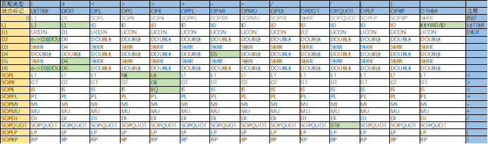

<center><strong>转换矩阵<strong></center>

为了便于维护与修改程序实现，使用Excel表格维护该状态转换矩阵，将其导出为csv格式后，编写程序简单处理即可得到程序内使用的状态转换矩阵。

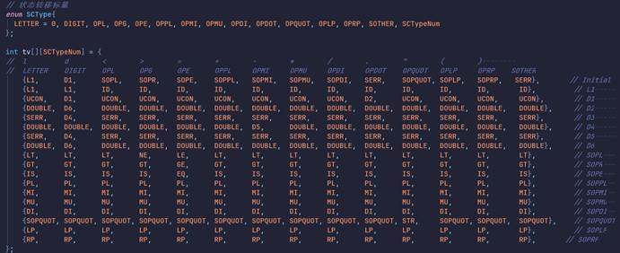

为方便状态转换矩阵中对状态转移进行描述，设计了如下枚举

#### 状态枚举：

状态矩阵中所有可能存在的状态

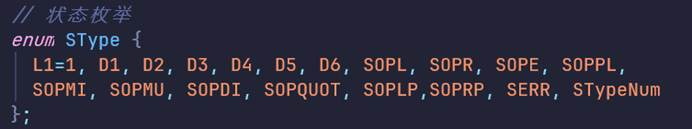

#### 类型枚举：

用于表示识别到的单词的类型。

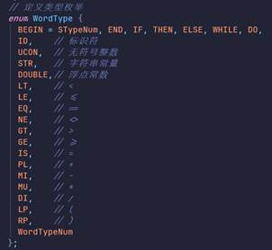

### 匹配过程


​	单词匹配的核心函数是next_word，该函数先读取完所有的空白字符，随后进入匹配。

识别字符、进行状态转移过程如下:

先获取字符，判断当前字符属于哪种匹配，再从状态矩阵查找次态。

1. 为保证状态转换矩阵的可拓展性与简洁性，对部分情况在状态转换时进行特判处理。
2. 若现态为D2和E2，要对科学计数法进行处理，判断当前字符是否为e或E，

- 若是，则将次态按照Excel中转移矩阵中的描述设置为D3

- 否则直接设置为处理过后的状态转移矩阵中的DOUBLE类型。

状态转换特判结束后，进行状态转换，并判断是否结束匹配，当遇到SERR，出错。当遇到其他输出终态，则退回多读的字符，并对识别到的单词进行结束处理。

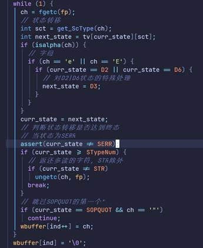

当终态为ID(标识符)时，查找关键字表，判断当前单词的类型，若在关键字表中匹配成功，则为对应类型的关键字，否则为标识符。

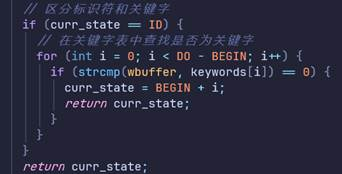

### 单词序列存储

为保存算法识别出的(class, val)对，定义了该结构体

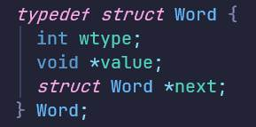

wtype用于存放单词类型，value指针用于存放值的地址

next指针用于存放下一个单词的地址。

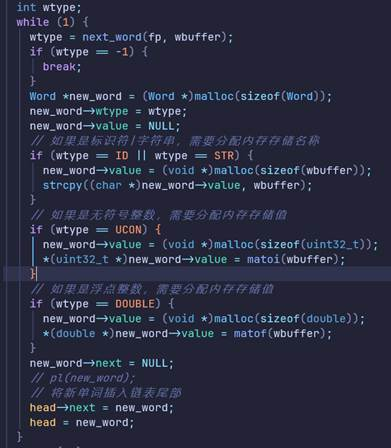

程序循环读取程序文件内容，读取到文件结束后结束识别。

对每个单词，根据单词类型来构造不同的value

- 标识符和字符串：新建内存空间，将wbuffer内容拷贝到新空间作为value内容。

- 无符号数或浮点数：新建内存空间，将wbuffer的内容以无符号数或浮点数的形式解析。


随后将构造的单词插入链表尾部。

###  整数与浮点数识别

#### 字符串转换整数：

先识别首字符是否为-

再从高到低每次取出一位数字，将前一次结果*10后加上去，处理完所有字符后得到结果。

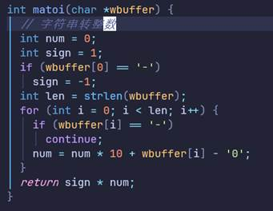

#### 字符串转换浮点数：

在e和E之前的整数部分直接按照整数识别，遇到小数点后开始累计小数位数，整数部分读取同上。

小数部分则根据当前浮点位数计算结果后再累加到结果上。

当遇到科学计数法，则对e后的整数进行识别，提取相应的幂次，再对e前处理的结果进行幂次处理。

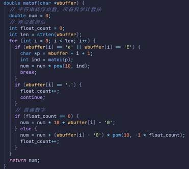

## 实验分析

测试用例如下

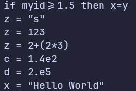

实验结果如下：

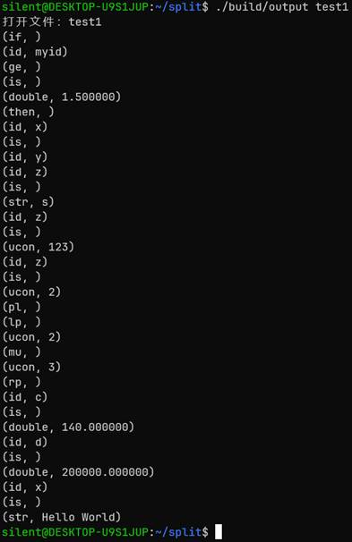

很好的完成了分词任务。

## 程序代码

```c
#include "def.h"
#include <stdlib.h>
// 定义关键字表
static char *keywords[] = {"begin", "end", "if",   "then", "else",   "while",
                           "do",    "id",  "ucon", "str",  "double", "lt",
                           "le",    "eq",  "ne",   "gt",   "ge",     "is",
                           "pl",    "mi",  "mu",   "di",   "lp",     "rp"};

// clang-format off
// 状态转移标量
enum SCType{
  LETTER = 0, DIGIT, OPL, OPG, OPE, OPPL, OPMI, OPMU, OPDI, OPDOT, OPQUOT, OPLP, OPRP, SOTHER, SCTypeNum
};

int tv[][SCTypeNum] = {
//  l         d        <        >        =        +        -        *        /        .        "        (        )        
//  LETTER    DIGIT    OPL      OPG      OPE      OPPL     OPMI     OPMU     OPDI     OPDOT    OPQUOT   OPLP     OPRP    SOTHER
    {L1,      D1,      SOPL,    SOPR,    SOPE,    SOPPL,   SOPMI,   SOPMU,   SOPDI,   SERR,    SOPQUOT, SOPLP,   SOPRP,   SERR},        // Initial
    {L1,      L1,      ID,      ID,      ID,      ID,      ID,      ID,      ID,      ID,      ID,      ID,      ID,       ID},         // L1     
    {UCON,    D1,      UCON,    UCON,    UCON,    UCON,    UCON,    UCON,    UCON,    D2,      UCON,    UCON,    UCON,     UCON},       // D1     
    {DOUBLE,  D6,      DOUBLE,  DOUBLE,  DOUBLE,  DOUBLE,  DOUBLE,  DOUBLE,  DOUBLE,  DOUBLE,  DOUBLE,  DOUBLE,  DOUBLE,   DOUBLE},     // D2     
    {SERR,    D4,      SERR,    SERR,    SERR,    SERR,    SERR,    SERR,    SERR,    SERR,    SERR,    SERR,    SERR,     SERR},       // D3     
    {DOUBLE,  DOUBLE,  DOUBLE,  DOUBLE,  DOUBLE,  DOUBLE,  D5,      DOUBLE,  DOUBLE,  DOUBLE,  DOUBLE,  DOUBLE,  DOUBLE,   DOUBLE},     // D4     
    {SERR,    D4,      SERR,    SERR,    SERR,    SERR,    SERR,    SERR,    SERR,    SERR,    SERR,    SERR,    SERR,     SERR},       // D5     
    {DOUBLE,  D6,      DOUBLE,  DOUBLE,  DOUBLE,  DOUBLE,  DOUBLE,  DOUBLE,  DOUBLE,  DOUBLE,  DOUBLE,  DOUBLE,  DOUBLE,   DOUBLE},     // D6
    {LT,      LT,      LT,      NE,      LE,      LT,      LT,      LT,      LT,      LT,      LT,      LT,      LT,       LT},         // SOPL   
    {GT,      GT,      GT,      GT,      GE,      GT,      GT,      GT,      GT,      GT,      GT,      GT,      GT,       GT},         // SOPR   
    {IS,      IS,      IS,      IS,      EQ,      IS,      IS,      IS,      IS,      IS,      IS,      IS,      IS,       IS},         // SOPE   
    {PL,      PL,      PL,      PL,      PL,      PL,      PL,      PL,      PL,      PL,      PL,      PL,      PL,       PL},         // SOPPL  
    {MI,      MI,      MI,      MI,      MI,      MI,      MI,      MI,      MI,      MI,      MI,      MI,      MI,       MI},         // SOPMI  
    {MU,      MU,      MU,      MU,      MU,      MU,      MU,      MU,      MU,      MU,      MU,      MU,      MU,       MU},         // SOPMU  
    {DI,      DI,      DI,      DI,      DI,      DI,      DI,      DI,      DI,      DI,      DI,      DI,      DI,       DI},         // SOPDI  
    {SOPQUOT, SOPQUOT, SOPQUOT, SOPQUOT, SOPQUOT, SOPQUOT, SOPQUOT, SOPQUOT, SOPQUOT, SOPQUOT, STR,     SOPQUOT, SOPQUOT,  SOPQUOT},    // SOPQUOT
    {LP,      LP,      LP,      LP,      LP,      LP,      LP,      LP,      LP,      LP,      LP,      LP,      LP,       LP},         // SOPLP
    {RP,      RP,      RP,      RP,      RP,      RP,      RP,      RP,      RP,      RP,      RP,      RP,      RP,       RP},         // SOPRP
};
// clang-format on

// 单词缓冲
char wbuffer[256];

static void pl(Word *p) {
  // 输出字符
  char *output = (char *)malloc(sizeof(char) * 65535);
  char *t = output;
  if (p->wtype == ID || p->wtype == STR) {
    // 标识符或字符串
    t += sprintf(t, "(%s, %s)\n", keywords[p->wtype - BEGIN], (char *)p->value);
  } else if (p->wtype == UCON) {
    // 无符号数
    t += sprintf(t, "(%s, %d)\n", keywords[p->wtype - BEGIN],
                 *(uint32_t *)p->value);
  } else if (p->wtype == DOUBLE) {
    // 浮点数字
    t += sprintf(t, "(%s, %lf)\n", keywords[p->wtype - BEGIN],
                 *(double *)p->value);
  } else {
    // 关键字或算符
    t += sprintf(t, "(%s, )\n", keywords[p->wtype - BEGIN]);
  }
  printf("%s", output);
  free(output);
}

static int get_ScType(char ch) {
  // 根据字符获取状态转移标量
  if ((ch >= 'a' && ch <= 'z') || (ch >= 'A' && ch <= 'Z'))
    return LETTER;
  if (ch >= '0' && ch <= '9')
    return DIGIT;
  char operators[] = "ld<>=+-*/.\"()";
  int len = strlen(operators);
  for (int i = 2; i < len; i++) {
    if (ch == operators[i]) {
      return i;
    }
  }
  return SOTHER;
}

static int matoi(char *wbuffer) {
  // 字符串转整数
  int num = 0;
  int sign = 1;
  if (wbuffer[0] == '-')
    sign = -1;
  int len = strlen(wbuffer);
  for (int i = 0; i < len; i++) {
    if (wbuffer[i] == '-')
      continue;
    num = num * 10 + wbuffer[i] - '0';
  }
  return sign * num;
}

static double matof(char *wbuffer) {
  // 字符串转浮点数, 带有科学计数法
  double num = 0;
  // 浮点数前后
  int float_count = 0;
  int len = strlen(wbuffer);
  for (int i = 0; i < len; i++) {
    if (wbuffer[i] == 'e' || wbuffer[i] == 'E') {
      char *p = wbuffer + i + 1;
      int ind = matoi(p);
      num = num * pow(10, ind);
      break;
    }
    if (wbuffer[i] == '.') {
      float_count++;
      continue;
    }
    // 普通数字
    if (float_count == 0) {
      num = num * 10 + wbuffer[i] - '0';
    } else {
      num = num + (wbuffer[i] - '0') * pow(10, -1 * float_count);
      float_count++;
    }
  }
  return num;
}

static int read_blank(FILE *fp) {
  /*
   * 跳过空白字符
   * @param fp 文件指针
   * @return 首个非空白字符(读取到EOF后返回-1)
   */
  char c;
  do {
    c = fgetc(fp);
  } while (c == ' ' || c == '\n' || c == '\t');
  // 已读取到文件末尾，无新数据，返回-1
  if (c == EOF)
    return -1;
  return c;
}

static int next_word(FILE *fp, char *wbuffer) {
  /*
   * 读取单词
   * @param fp 文件指针
   * @param wbuffer 单词缓冲区
   * @return 单词类型WordType(已到文件末尾且无新数据，返回-1)
   */
  int curr_state = 0; // 当前状态
  int ch;             // 当前字符
  int ind = 0;        // 单词缓冲区指针
  if ((ch = read_blank(fp)) == -1)
    return -1;
  ungetc(ch, fp);
  while (1) {
    ch = fgetc(fp);
    // 状态转移
    int sct = get_ScType(ch);
    int next_state = tv[curr_state][sct];
    if (isalpha(ch)) {
      // 字母
      if (ch == 'e' || ch == 'E') {
        if (curr_state == D2 || curr_state == D6) {
          // 对D2|D6状态的特殊处理
          next_state = D3;
        }
      }
    }
    curr_state = next_state;
    // 判断状态转移是否达到终态
    // 当状态为SERR
    assert(curr_state != SERR);
    if (curr_state >= STypeNum) {
      // 返还多读的字符, STR除外
      if (curr_state != STR)
        ungetc(ch, fp);
      break;
    }
    // 跳过SOPQUOT的第一个"
    if (curr_state == SOPQUOT && ch == '"')
      continue;
    wbuffer[ind++] = ch;
  }
  wbuffer[ind] = '\0';
  // 区分标识符和关键字
  if (curr_state == ID) {
    // 在关键字表中查找是否为关键字
    for (int i = 0; i < DO - BEGIN; i++) {
      if (strcmp(wbuffer, keywords[i]) == 0) {
        curr_state = BEGIN + i;
        return curr_state;
      }
    }
  }
  return curr_state;
}

Word *get_words(char *filename) {
  FILE *fp;
  Word *tail = (Word *)malloc(sizeof(Word));
  Word *head = tail;
  tail->next = NULL;
  fp = fopen(filename, "r");
  if (fp == NULL) {
    printf("文件打开失败\n");
    assert(0);
  }
  int wtype;
  while (1) {
    wtype = next_word(fp, wbuffer);
    if (wtype == -1) {
      break;
    }
    Word *new_word = (Word *)malloc(sizeof(Word));
    new_word->wtype = wtype;
    new_word->value = NULL;
    // 如果是标识符|字符串，需要分配内存存储名称
    if (wtype == ID || wtype == STR) {
      new_word->value = (void *)malloc(sizeof(wbuffer));
      strcpy((char *)new_word->value, wbuffer);
    }
    // 如果是无符号整数，需要分配内存存储值
    if (wtype == UCON) {
      new_word->value = (void *)malloc(sizeof(uint32_t));
      *(uint32_t *)new_word->value = matoi(wbuffer);
    }
    // 如果是浮点整数，需要分配内存存储值
    if (wtype == DOUBLE) {
      new_word->value = (void *)malloc(sizeof(double));
      *(double *)new_word->value = matof(wbuffer);
    }
    new_word->next = NULL;
    // pl(new_word);
    // 将新单词插入链表尾部
    tail->next = new_word;
    tail = new_word;
  }
  fclose(fp);
  Word *ret = head->next;
  free(head);
  return ret;
}

void free_wordlist(Word *p) {
  while (p != NULL) {
    // 打印
    pl(p);
    Word *temp = p;
    p = p->next;
    if (temp->value)
      free(temp->value);
    free(temp);
  }
}

```

 
