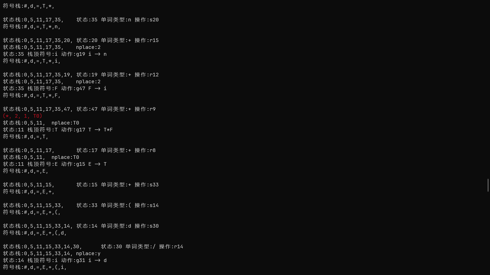
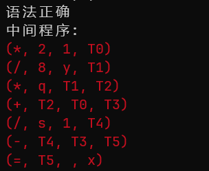

# 编译原理实验一:词法分析

<center><strong>Author：赵桂龙<br>Class：计212<br>Sno：215216</strong></center>

## 实验设计

### 文法语义的拓展

在LR(1)分析的基础上，进一步加入语法制导翻译过程，在语法分析过程中将语句翻译为四元式。

本项目所有代码存放在[SilentInt/compliation_lab: 河北工业大学大三下编译原理实验 (github.com)](https://github.com/SilentInt/compliation_lab)

#### 单词语义拓展

需要对原有的文法和单词语义进行拓展，为单词添加place语义，表示当前单词存放的位置。在实验二的程序中，状态栈中元素仅存储入栈的状态序列，拓展语义后，将状态栈元素设计改变为如下结构：

```c
typedef struct StateStack {
  int status;
  char *place;
} StateStack;
```

改动后状态栈拥有了同时存放了当前状态与单词位置信息的能力，单词状态用int表示，与状态转移矩阵的列对应，单词位置用字符指针存放，指向当前单词存放位置所对应的变量名称。

后续可通过构造变量名称与地址的映射关系来确定地址分配。

#### 语义操作定义

新增两个语义操作

```c
char *ENTRY(uint32_t val);
char *NewTemp();
```

ENTRY操作用于在遇到UCON（无符号数）时，将数字转换成对应字面量字符。

NewTemp操作用于申请临时变量，返回临时变量名。

#### 文法拓展

本实验计划实现：

1. 加减乘除
2. 字面量与标识符（变量）支持
3. 赋值操作

对实验二中的文法进行拓展

```c
s -> P
P -> S
P -> P S
S -> I
S -> W
S -> q
E -> E + T
E -> E - T
E -> T
T -> T * F
T -> T / F
T -> F
F -> i
F -> ( E )
i -> d
i -> n
I -> f ( E ) t P e
W -> w ( E ) t P e
q -> d = E
```

根据语义处理动作，将文法分组分类

```c
# 双目操作符
E -> E + T
E -> E - T
T -> T * F
T -> T / F
# 该组对应处理
t1 = state_stack[--state_top].place;
state_top--;
t2 = state_stack[--state_top].place;
temp = NewTemp();
nplace = temp;
Gen(sign, t1, t2, temp)
```

其中t1,t2对应当前生成式的操作数，而nplace对应规约后入栈元素的place字段

同理还能得到：

```c
# 单元素规约
s->P
P->S
S->I
S->W
S->q
E->T
T->F
F->i
# 该组对应处理
nplace = state_stack[--state_top].place;
```

该组无产生式

```c
# F->(E)
state_top--;
nplace = state_stack[--state_top].place;
state_top--;
```

该组无产生式

```c
# 赋值操作
q -> d = E
# 该组对应处理
t1 = state_stack[--state_top].place;
state_top--;
t2 = state_stack[--state_top].place;
Gen(=, t1, , t2)
```

t1对应赋值符号右值，t2对应待赋值变量（左值）

在移进处理时，对标识符类型的单词（变量）的place字段进行初始化（此处的操作是将标识符的值赋值给变量）可用标识符名称建立符号表。

```c
# 移进时对标识符类型的初始化处理
if (word->wtype == ID) {
  state_stack[state_top].place = word->value;
}
```

## 实验分析

测试用例如下

```c
x = 1*2+(y/8)*q-1/s
```



<center><strong>语法分析过程中制导翻译的输出</strong></center>



<center><strong>语法分析结束后的中间代码输出</strong></center>

## 实验代码

添加的实验核心代码部分如下：

<center><strong>cg.c</strong></center>

```c
#include "cg.h"
char *ENTRY(uint32_t val) {
  char *t = (char *)malloc(sizeof(char) * 32);
  sprintf(t, "%u", val);
  return t;
}

int t_cnt = 0;
char *NewTemp() {
  char *t = (char *)malloc(sizeof(char) * 32);
  sprintf(t, "T%u", t_cnt++);
  return t;
}
```

<center><strong>cg.h</strong></center>

```c
#ifndef __CG_H__
#define __CG_H__
#include "def.h"
char *ENTRY(uint32_t val);
char *NewTemp();
#endif
```

<center><strong>lr.c</strong></center>

```c
int lrparser(Word *word) {
  // 初始化状态栈
  StateStack state_stack[100] = {0};
  int state_top = 1;
  // 初始化符号栈
  char *symbol_stack[100] = {0};
  int symbol_top = 0;
  symbol_stack[symbol_top++] = ind2op(op2ind('#'));

  Word *pword = NULL;
  char m_prog[1 << 10];
  int m_prog_len = 0;
  while (state_top != 0) {
    // 将单词类型转换为cv表的索引
    int word_index = word ? op2ind(word->wtype) : op2ind('#');
    // printf("word_index:%d\n", word_index);
    // 当前状态：状态栈栈顶状态
    int state = state_stack[state_top - 1].status;
    // 根据当前状态和索引查找操作
    char *perform = cv[state][word_index];

    // 打印状态栈
    print_state_stack(state_stack, state_top);
    printf("\t");
    printf("状态:%d 单词类型:%s 操作:%s\n", state, ind2op(word_index), perform);

    // 当前状态没有对应的操作
    if (perform[0] == '\0') {
      printf("不存在操作，语法错误\n");
      // 打印符号栈
      print_symbol_stack(symbol_stack, symbol_top);
      printf("\n");
      // 打印状态栈
      print_state_stack(state_stack, state_top);
      printf("\n");
      assert(0);
    } else if (perform[0] == 'a') {
      // 接受
      printf("语法正确\n");
      break;
    } else if (perform[0] == 's') {
      // 移进
      // 状态入栈
      if (word->wtype == ID) {
        state_stack[state_top].place = word->value;
      }
      state_stack[state_top++].status = atoi(perform + 1);
      // 符号入栈
      symbol_stack[symbol_top++] = ind2op(op2ind(word->wtype));
      // 词法分析下一个单词
      pword = word;
      word = word->next;
    } else if (perform[0] == 'r') {
      // 规约
      // 产生式索引
      int production_index = atoi(perform + 1);
      char *t1;
      char *t2;
      char *temp;
      char *nplace;
      // 根据产生式索引，进行语法制导翻译
      switch (production_index) {
      case 6:  // +
      case 7:  // -
      case 9:  // *
      case 10: // /
        t1 = state_stack[--state_top].place;
        state_top--;
        t2 = state_stack[--state_top].place;
        temp = NewTemp();
        nplace = temp;
        printf("\033[31m(%c, %s, %s, %s)\033[0m\n",
               "000000+-0*/"[production_index], t1, t2, temp);
        m_prog_len +=
            sprintf(m_prog + m_prog_len, "\033[31m(%c, %s, %s, %s)\033[0m\n",
                    "000000+-0*/"[production_index], t1, t2, temp);
        break;
      case 14: // i->d
        nplace = (char *)pword->value;
        state_top--;
        break;
      case 15: // i->n
               // 需要填充字面量
        nplace = ENTRY(*(uint32_t *)pword->value);
        state_top--;
        break;
      case 0:  // s->P
      case 1:  // P->S
      case 3:  // S->I
      case 4:  // S->W
      case 5:  // S->q
      case 8:  // E->T
      case 11: // T->F
      case 12: // F->i
        nplace = state_stack[--state_top].place;
        break;
      case 13:
        // F->(E)
        state_top--;
        nplace = state_stack[--state_top].place;
        state_top--;
        break;
      case 18:
        // Assign
        t1 = state_stack[--state_top].place;
        state_top--;
        t2 = state_stack[--state_top].place;
        printf("\n\033[31m(=, %s, , %s)\033[0m\n", t1, t2);
        m_prog_len += sprintf(m_prog + m_prog_len,
                              "\033[31m(=, %s, , %s)\033[0m\n", t1, t2);
      }

      // 产生式右部长度
      int len = strlen(prod_right[production_index]);
      // 弹出状态栈, 符号栈
      for (int i = 0; i < len; i++) {
        //   state_top--;
        symbol_top--;
      }
      // 产生式左部
      char left = prod_left[production_index];
      // 左部入符号栈
      symbol_stack[symbol_top++] = ind2op(op2ind(left));

      // 打印状态栈
      print_state_stack(state_stack, state_top);
      printf("\t");

      // 规约结束，开始goto

      // GOTO
      // 根据状态栈顶和左部符号查找goto表
      int state = state_stack[state_top - 1].status;
      int left_index = op2ind(left);

      // goto表转移状态入栈
      printf("nplace:%s\n", nplace);
      state_stack[state_top].place = nplace;
      state_stack[state_top++].status = atoi(cv[state][left_index] + 1);

      // 打印状态转移
      printf("状态:%d 栈顶符号:%s 动作:%s %c -> %s\n", state,
             ind2op(left_index), cv[state][left_index],
             prod_left[production_index], prod_right[production_index]);
    }
    // 打印符号栈
    print_symbol_stack(symbol_stack, symbol_top);
    printf("\n\n");
  }
  printf("中间程序:\n%s", m_prog);
  return 0;
}
```


##### 
