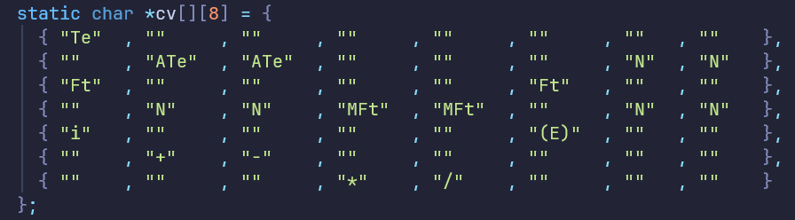
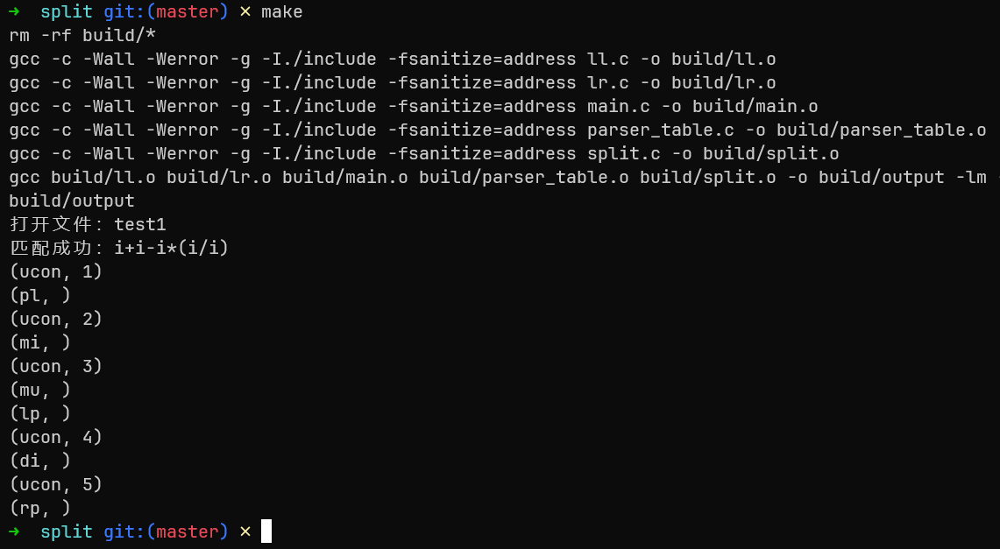
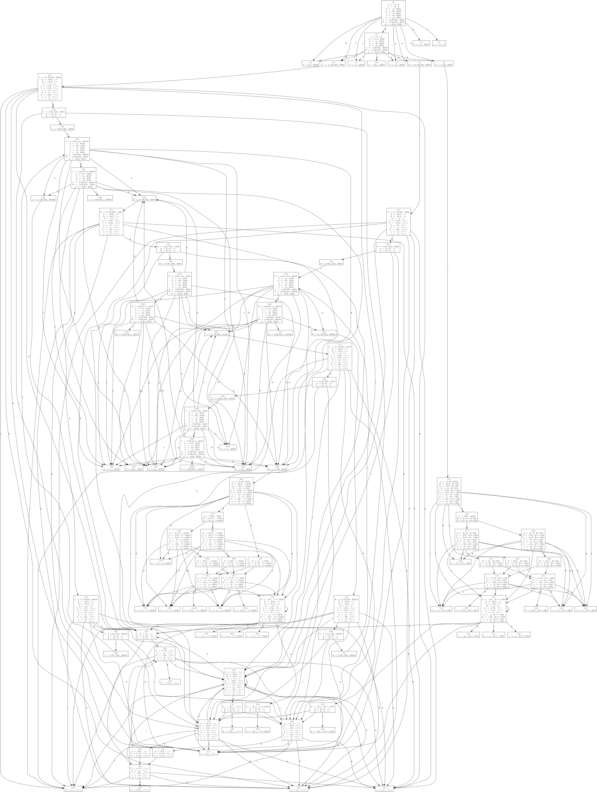
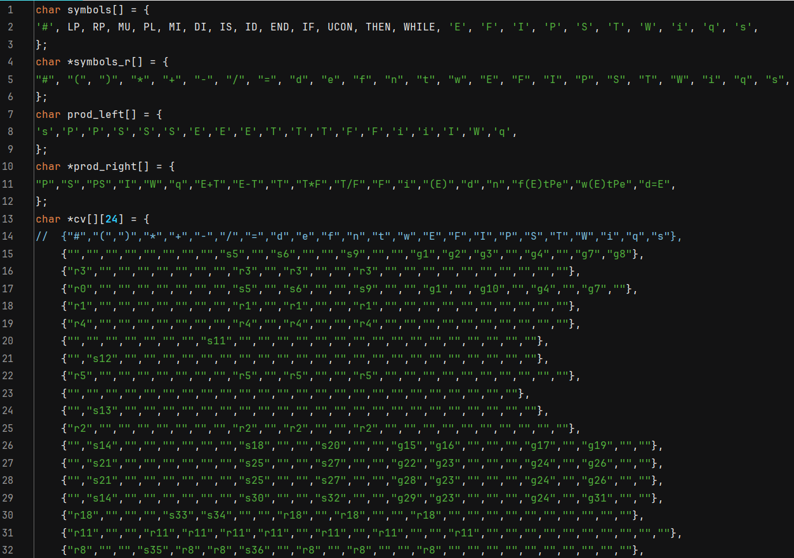
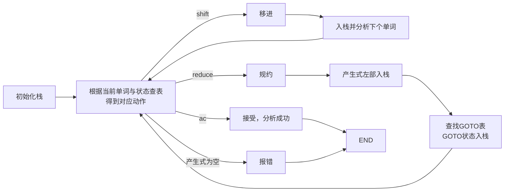
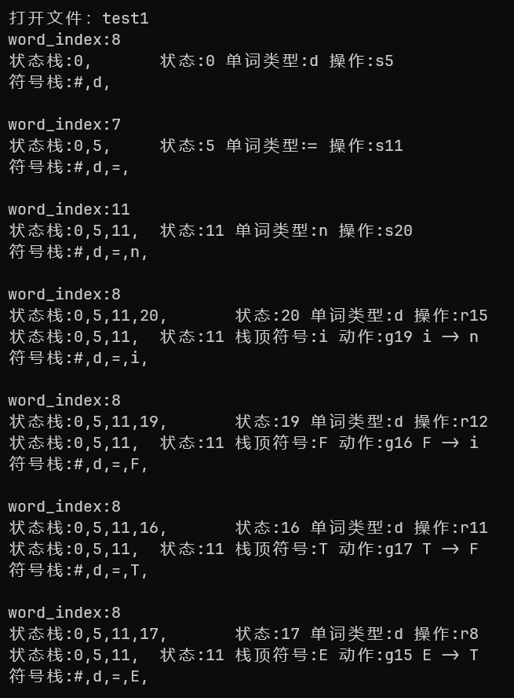

# 编译原理实验二:语法分析

<center><strong>Author：赵桂龙<br>Class：计212<br>Sno：215216</strong></center>

## 实验设计

本实验要求在实验1词法分析的基础上，设计上下文无关文法、构造状态转换矩阵、编写语法分析驱动程序。

实验过程中实现了LL(1)和LR(1)文法分析、LR(1)文法自动生成DFA和状态转换矩阵。

本项目所有代码存放在[SilentInt/compliation_lab: 河北工业大学大三下编译原理实验 (github.com)](https://github.com/SilentInt/compliation_lab)

## LL(1)语法分析

本实验构造的第一种语法分析器是LL(1)语法分析，实现了算数表达式的解析。

### 设计文法

文法设计如下：

```c
E → T | E+T | E-T
T → F | T*F | T/F
F → i | (E)
```


### 构造状态转换矩阵

|      | i    | +    | -    | *    | /    | (    | )    |  #   |
| ---- | ---- | ---- | ---- | ---- | ---- | ---- | ---- | :--: |
| 0    | Te   |      |      |      |      |      |      |      |
| 1    |      | ATe  | ATe  |      |      |      | N    |  N   |
| 2    | Ft   |      |      |      |      | Ft   |      |      |
| 3    |      | N    | N    | MFt  | MFt  |      | N    |  N   |
| 4    | i    |      |      |      |      | (E)  |      |      |
| 5    |      | +    | -    |      |      |      |      |      |
| 6    |      |      |      | *    | /    |      |      |      |

将该矩阵以二维char*指针数组的形式保存在c语言程序中，效果如下：



### 驱动程序设计

首先初始化分析栈，将开始符号压入栈顶，并初始化一个数组用于存储已经匹配成功的单词。

```c
int parser(Word *p) {
// 表达式解析器
  Word *w = p;
  // 初始化栈
  int top = 0;
  char stack[1000];
  stack[top++] = '#';
  stack[top++] = 'E';
  // 已经匹配的单词
  int mtop = 0;
  char matched[1000];
    ...
}
```

然后解析当前单词类型，将当前单词类型转换为在状态矩阵中的索引：

```c
int parser(Word *p) {
  // 初始化（略）
    ...
        
  while (top != 0) {
    int word;
    int wt;
    if (w != NULL) {
      // 取一个单词
      word = w2c(w); // 单词类型对应字符
      // 当前字符对应的操作符索引
      wt = opc2ind(word);
      w = w->next; // 下一个单词
    } else {
      word = '#';
      wt = opc2ind('#');
    }
      // 其他代码
}

```

进入分析过程

1. 从状态栈中取出栈顶元素，当取到开始符则解析成功，否则继续
2. 从分析表中根据当前状态与当前单词的索引，取出对应的产生式
   1. 若产生式为空，则出错，打印分析栈
      1. 若产生式为$$\epsilon$$，则跳过当前单词后续
      1. 若找到合法产生式，则将产生式逆序压入状态栈
3. 当状态栈为空时，结束分析过程，打印所有匹配到的字符

```c
int parser(Word *p) {
  // 初始化（略）
    ...
  while (top != 0) {
  // 获取状态转换索引
 	 ...
    char c = 0;
    while (top != 0) {
      c = stack[--top]; // 栈顶元素
      if (word == c) {
        // 匹配成功
        if (word != '#')
          matched[mtop++] = c;
        break;
      }
      // 从预测分析表中取出产生式
      // printf("当前状态：%c，当前单词：%c\n", c, word);
      char *p = cv[c2s(c)][wt];
      if (p[0] == '\0') {
        // 不存在的产生式
        printf("不存在产生式，语法错误, 分析栈：\n");
        for (int i = 0; i < top; i++) {
          printf("%c", stack[i]);
        }
        printf("\n当前状态：%c 单词类型：%c\n", c, word);

        assert(0);
      } else if (p[0] == 'N') {
        // 空产生式
        continue;
      }
      // printf("产生式：%s\n", p);
      // 将产生式逆序压入栈中
      int slen = strlen(p);
      for (int i = slen - 1; i >= 0; i--) {
        stack[top++] = p[i];
      }
    }
  }

  // printf("匹配结束，top:%d, stack:%s\n", top, stack);
  if (top == 0) {
    // 匹配成功
    matched[mtop++] = 0;
    printf("匹配成功：%s\n", matched);
    return 1;
  } else {
    // 匹配失败，打印分析栈
    printf("匹配失败，分析栈低到高：");
    for (int i = 0; i < top; i++) {
      printf("%c", stack[i]);
    }
    printf("当前单词：%c\n", w2c(w));
    return 0;
  }
}
```

### 程序效果展示

测试用例:

```
1+2-3*(4/5)
```

效果如图：



## LR(1)语法分析

### 自动化构造文法DFA

构造LR(1)文法的状态转换矩阵的过程涉及到闭包的求解与向前搜索符（展望符）的求解，随着文法的拓展，每次重新求解整个庞大的DFA，工作量过于庞大，因此考虑构建自动化程序。

本实验过程中，用Python实现了给定文法，自动求解DFA并可视化、生成驱动程序用于分析的`parser_table.c`文件。

文法如下，实现了多条语句并列、循环结构、赋值语句、算数表达式的匹配。

```c
s -> P
P -> S
P -> P S
S -> I
S -> W
S -> q
E -> E + T
E -> E - T
E -> T
T -> T * F
T -> T / F
T -> F
F -> i
F -> ( E )
i -> d
i -> n
I -> f ( E ) t P e
W -> w ( E ) t P e
q -> d = E
```

文法在自动化工具中给出格式如下：

```python
grammar = {
    's': [['P']],
    'P': [['S'], ['P', 'S']],
    'S': [['I'], ['W'], ['q']],
    'E': [['E', '+', "T"], ['E', '-', 'T'], ['T']],
    'T': [['T', '*', 'F'], ['T', '/', 'F'], ['F']],
    'F': [['i'], ['(', 'E', ')']],
    'i': [['d'], ['n']],  # 可计算符号
    'I': [['f', '(', 'E', ')', 't', 'P', 'e']],  # if
    'W': [['w', '(', 'E', ')', 't', 'P', 'e']],  # while
    'q': [['d', '=', 'E']],  # 赋值
}
```

*以下内容不用看*，

[点我跳过](#jump_1)


自动求解闭包后，得到的DFA可视化状态转换图示例如下：



好吧这已经是人类不可读水平了(-_-)，再来看看自动导出的状态矩阵


呼呼，这次比上面好多了，最后再来看看自动生成的c语言资源文件吧（太多了我就不全截图了）



### 驱动程序设计
<a id="jump_1"></a>

好了看完了上面庞大吓人的DFA（没错就是为了体现自动化程序的伟大），下面的内容就对人类友好多了。

我们来分析一下LR文法的*驱动程序结构*吧：

```c
int lrparser(Word *word) {
  // 初始化状态栈
  // 初始化符号栈
  while (state_top != 0) {
    // 将单词类型转换为cv表的索引
    // 根据当前状态和索引查找操作
    char *perform = cv[state][word_index];
    // 打印状态栈
    
    // 状态转换
    // 当前状态没有对应的操作
    if (perform[0] == '\0') {
      printf("不存在操作，语法错误\n");
      // 打印符号栈
      // 打印状态栈
      assert(0);
    } else if (perform[0] == 'a') {
      // 接受
      printf("语法正确\n");
      break;
    } else if (perform[0] == 's') {
      // 移进
      // 状态入栈
      // 符号入栈
      // 词法分析下一个单词
      word = word->next;
    } else if (perform[0] == 'r') {
      // 规约
      // 产生式索引
      int production_index = atoi(perform + 1);
      // 弹出产生式右部长度的状态栈, 符号栈
      // 左部入符号栈
      // 打印状态栈

      // 规约结束，开始goto
      // GOTO
      // 根据状态栈顶和左部符号查找goto表
      // goto表转移状态入栈
      // 打印状态转移
    // 打印符号栈
  }
  return 0;
}

```

以上的代码只保留了关键流程，根据上述代码可以得到，驱动程序流程如下：



### 程序效果展示

测试用例：

```c
x =3523
fg=4543
while (23+1*(34+34)) then
  x=1+567+q
end
if (sd+1) then
  x=1+567+q
  u = 345
end
```

分析效果如图：



