# 实验9 数据库设计

<center><strong>Author：赵桂龙<br>Class：计212<br>Sno：215216</strong></center>

## 实验目的

掌握数据库存储过程的设计和使用方法。

## 实验内容和要求

存储过程的定义，存储过程运行，存储过程更名，存储过程删除。

## 实验步骤

### 定义一个存储过程 proc1，更新所有订单(含税折扣价)的总价，执行这个存储过程。 

```sql
# 定义一个存储过程proc1，更新所有订单(含税折扣价)的总价，执行这个存储过程
create procedure proc1()
begin
    update orders,
        (select orderkey, sum(extendedprice * (1 - discount) * (1 + tax)) as sum_price
         from lineitem
         group by orderkey) as temp
    set orders.totalprice = temp.sum_price
    where orders.orderkey = temp.orderkey;
end;

call proc1();
```

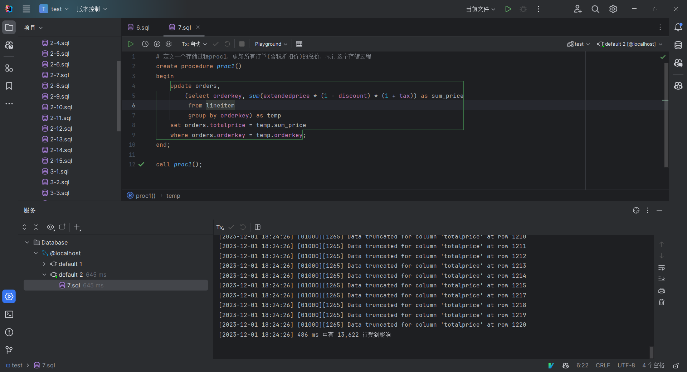

由于精度设置为两位小数，因此过程中会出现数据精度损失

### 定义一个存储过程 proc2，更新给定订单的(含税折扣价)的总价，执行这个存储过 程。 

```sql
# 定义一个存储过程 proc2，更新给定订单的(含税折扣价)的总价，执行这个存储过程。
# 展示订单1的总价
select totalprice
from orders
where orderkey = 1;

create procedure proc2(in order_key int)
begin
    declare sum_price decimal(12, 2);
    select sum(extendedprice * (1 - discount) * (1 + tax))
    into sum_price
    from lineitem
    where lineitem.orderkey = order_key;
    update orders
    set totalprice = sum_price
    where orders.orderkey = order_key;
end;

call proc2(1);
```

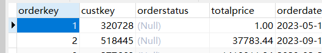

<center><strong>手动修改订单1的总价</strong></center>

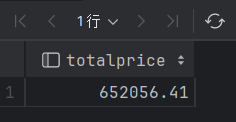

<center><strong>改动后的价格</strong></center>

### 定义一个存储过程 proc3，更新某个顾客的所有订单的（含税折扣价）总价，执行这个存储过程。 

```sql
# 定义一个存储过程 proc3，更新某个顾客的所有订单的（含税折扣价）总价，执行这个存储过程。
select *
from orders
where custkey = 574;

create procedure proc3(in cust_key int)
begin
    update orders,
        (select orderkey, sum(extendedprice * (1 - discount) * (1 + tax)) as sum_price
         from lineitem
         where orderkey in (select orderkey
                            from orders
                            where custkey = cust_key)
         group by orderkey) as temp
    set orders.totalprice = temp.sum_price
    where orders.orderkey = temp.orderkey;
end;

call proc3(574);
```

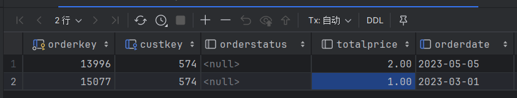

<center><strong>执行前修改总价</strong></center>

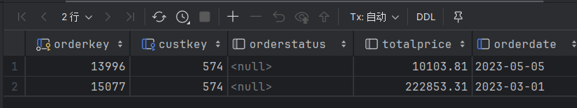

<center><strong>执行后效果</strong></center>

### 定义一个存储过程 proc4，更新某个顾客的所有订单的（含税折扣价）总价并输出该总价，执行这个存储过程。 

```sql
# 定义一个存储过程 proc4，更新某个顾客的所有订单的（含税折扣价）总价并输出该总价，执行这个存储过程。
select *
from orders
where custkey = 574;

create procedure proc4(in cust_key int)
begin
    update orders,
        (select orderkey, sum(extendedprice * (1 - discount) * (1 + tax)) as sum_price
         from lineitem
         where orderkey in (select orderkey
                            from orders
                            where custkey = cust_key)
         group by orderkey) as temp
    set orders.totalprice = temp.sum_price
    where orders.orderkey = temp.orderkey;
    select orderkey, totalprice
    from orders
    where custkey = cust_key;
end;

call proc4(574);
```

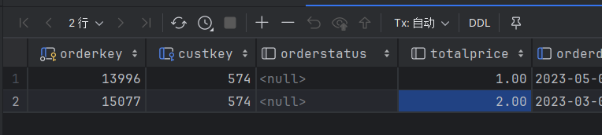

<center><strong>执行前修改总价</strong></center>

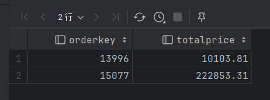

<center><strong>执行后输出效果</strong></center>

### 删除存储过程 proc4。 

```sql
drop procedure proc4;
```


### 定义一个存储过程 proc5，更新某年订单(含税折扣价)的总价，执行这个存储过程。 （要求使用游标完成）。

```sql
# 定义一个存储过程 proc5，更新某年订单(含税折扣价)的总价，执行这个存储过程。 （要求使用游标完成）。
select *
from orders
where orderdate >= '2022-01-01'
  and orderdate < '2023-01-01';

create procedure proc5(in year int)
begin
    declare order_key int;
    declare sum_price decimal(12, 2);
    declare done int default false;
    declare cur cursor for
        select orderkey
        from orders
        where orderdate >= concat(year, '-01-01')
          and orderdate < concat(year + 1, '-01-01');
    declare continue handler for not found set done = true;
    open cur;
    repeat
        fetch cur into order_key;
        if not done then
            select sum(extendedprice * (1 - discount) * (1 + tax))
            into sum_price
            from lineitem
            where lineitem.orderkey = order_key;
            update orders
            set totalprice = sum_price
            where orders.orderkey = order_key;
        end if;
    until done end repeat;
    close cur;
end;

call proc5(2022);
```

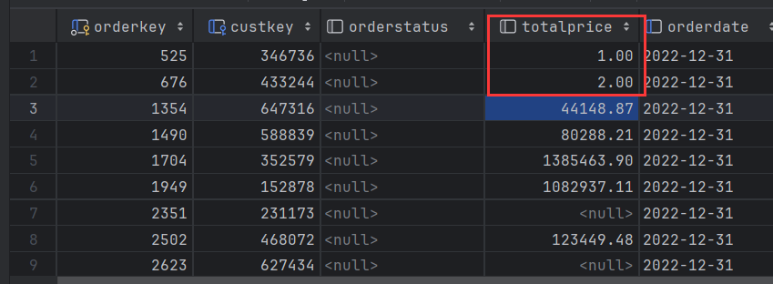

<center><strong>执行前修改总价</strong></center>

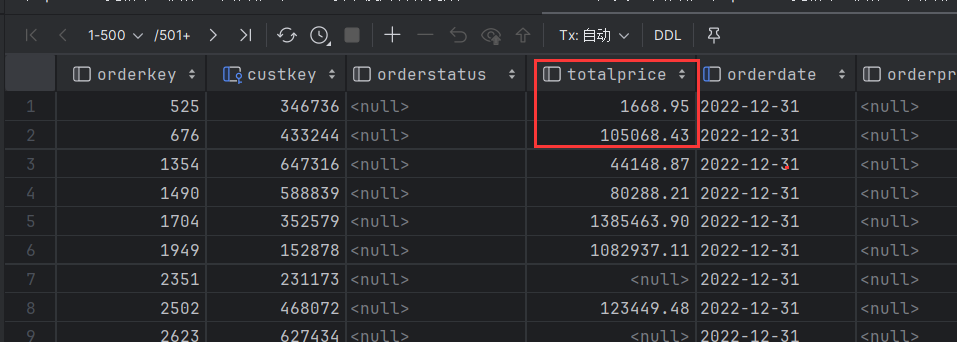

<center><strong>执行后输出效果</strong></center>

### 定义一个存储过程 proc6，能够根据某年(年份作为输入参数，整数)各个客户的下订单购买情况，把该年客户订单总金额超过某个阈值（该阈值为输入参数，为整数）的客户表（customer）中的备注（comment）字段更新为重要客户（“SVIP”）（要求使用游标完成）。

```sql
# 定义一个存储过程 proc6，能够根据某年(年份作为输入参数，整数)各个客户的下订单购买情况，把该年客户订单总金额超过某个阈值（该阈值为输入参数，为整数）的客户表（customer）中的备注（comment）字段更新为重要客户（“SVIP”）（要求使用游标完成）。
select custkey, comment
from customer
where custkey in (select custkey
                  from orders
                  where orderdate >= '2022-01-01'
                    and orderdate < '2023-01-01'
                  group by custkey
                  having sum(totalprice) > 1000000);

create procedure proc6(in year int, in threshold int)
begin
    declare cust_key int;
    declare done int default false;
    declare cur cursor for
        select custkey
        from orders
        where orderdate >= concat(year, '-01-01')
          and orderdate < concat(year + 1, '-01-01')
        group by custkey
        having sum(totalprice) > threshold;
    declare continue handler for not found set done = true;
    open cur;
    repeat
        fetch cur into cust_key;
        if not done then
            update customer
            set comment = 'SVIP'
            where customer.custkey = cust_key;
        end if;
    until done end repeat;
    close cur;
end;

call proc6(2022, 1000000);
```


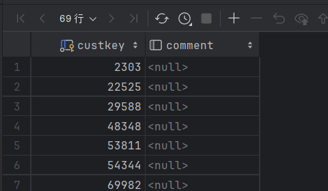

<center><strong>更新前</strong></center>

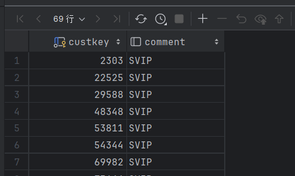

<center><strong>更新后</strong></center>