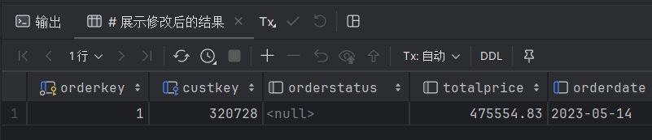

# 实验8 触发器实验

<center><strong>Author：赵桂龙<br>Class：计212<br>Sno：215216</strong></center>

## 实验目的

掌握数据库触发器的设计和使用方法

## 实验内容和要求

定义 BEFORE 触发器和 AFTER 触发器。能够理解不同类型触发器的作用和执行原理，验 证触发器的有效性

## 实验步骤

### AFTER 触发器

####  在 Lineitem 表上定义一个 UPDATE 触发器，当修改订单明细（即修改订单明细价格 extendeprice、折扣 discount、税率 tax）时，自动修改订单 Orders 的 TotalPrice，以保持数据一致性。 

```sql
create trigger update_totalprice
    after update
    on Lineitem
    for each row
begin
    update orders
    set totalprice = totalprice - old.extendedprice * (1 - old.discount) * (1 + old.tax)
        + new.extendedprice * (1 - new.discount) * (1 + new.tax)
    where orders.orderkey = old.orderkey;
end;
```

#### 在 Lineitem 表上定义一个 INSERT 触发器，当增加一项订单明细时，自动修改订单 Orders 的 TotalPrice，以保持数据的一致性。 

```sql
create trigger insert_totalprice
    after insert
    on Lineitem
    for each row
begin
    update orders
    set totalprice = totalprice + new.extendedprice * (1 - new.discount) * (1 + new.tax)
    where orders.orderkey = new.orderkey;
end;
```

#### 在 Lineitem 表上定义一个 DELETE 触发器，当删除一项订单明细时，自动修改订单 Orders 的 TotalPrice，以保持数据一致性。 

```sql
create trigger delete_totalprice
    after delete
    on Lineitem
    for each row
begin
    update orders
    set totalprice = totalprice - old.extendedprice * (1 - old.discount) * (1 + old.tax)
    where orders.orderkey = old.orderkey;
end;
```

#### 验证上面的三个触发器是否起作用。 

```sql
# 1. 修改订单明细（即修改订单明细价格 extendeprice、折扣 discount、税率 tax）时，自动修改订单 Orders 的 TotalPrice，以保持数据一致性。
update lineitem
set extendedprice = 10
where orderkey = 1 and linenumber = 1;
# 展示修改后的结果
select * from orders where orderkey = 1;
```



<center><strong>extendprice=1000时</strong></center>


<center><strong>extendprice=10时</strong></center>

```sql
# 2. 增加一项订单明细时，自动修改订单 Orders 的 TotalPrice，以保持数据的一致性。
insert into lineitem(orderkey, linenumber, extendedprice, discount, tax)
values(1, 7, 10, 0.1, 0.1);
# 展示修改后的结果
select * from orders where orderkey = 1;
```


<center><strong>插入之前</strong></center>


<center><strong>插入之后</strong></center>

```sql
# 3. 删除一项订单明细时，自动修改订单 Orders 的 TotalPrice，以保持数据一致性。
delete from lineitem where orderkey = 1 and linenumber = 7;
# 展示修改后的结果
select * from orders where orderkey = 1;
```


<center><strong>删除之前</strong></center>


<center><strong>删除之后</strong></center>

### BEFORE 触发器

####  在 Lineitem 表上定义一个 BEFORE UPDATE 触发器，当修改订单明细中的数量 （quantity）时，先检查供应表 PartSupp 中的可用数量 availqty 是否足够。 

```sql
# 在 Lineitem 表上定义一个 BEFORE UPDATE 触发器，当修改订单明细中的数量 （quantity）时，先检查供应表 PartSupp 中的可用数量 availqty 是否足够。
# 如果足够，则修改供应表 PartSupp 中的可用数量 availqty，否则不修改。
create trigger update_quantity
    before update
    on Lineitem
    for each row
begin
    declare v_availqty int;
    select availqty into v_availqty
    from partsupp
    where partsupp.partkey = new.partkey and partsupp.suppkey = new.suppkey;
    if v_availqty >= new.quantity then
        update partsupp
        set availqty = availqty - new.quantity
        where partsupp.partkey = new.partkey and partsupp.suppkey = new.suppkey;
    end if;
end;
```


#### 在 Lineitem 表上定义一个 BEFORE INSERT 触发器，当插入订单明细时，先检查供应表 PartSupp 中的可用数量 availqty 是否足够。

```sql
# 在 Lineitem 表上定义一个 BEFORE INSERT 触发器，当插入订单明细时，先检查供应表 PartSupp 中的可用数量 availqty 是否足够。
# 如果足够，则修改供应表 PartSupp 中的可用数量 availqty，否则不修改。
create trigger insert_quantity
    before insert
    on Lineitem
    for each row
begin
    declare v_availqty int;
    select availqty into v_availqty
    from partsupp
    where partsupp.partkey = new.partkey and partsupp.suppkey = new.suppkey;
    if v_availqty >= new.quantity then
        update partsupp
        set availqty = availqty - new.quantity
        where partsupp.partkey = new.partkey and partsupp.suppkey = new.suppkey;
    end if;
end;
```


#### 在 Lineitem 表上定义一个 BEFORE DELETE 触发器，当删除订单明细时，该订单明细项订购的数量要归还于对应的零件供应记录。

```sql
# 在 Lineitem 表上定义一个 BEFORE DELETE 触发器，当删除订单明细时，该订单明细项订购的数量要归还于对应的零件供应记录。
create trigger delete_quantity
    before delete
    on Lineitem
    for each row
begin
    update partsupp
    set availqty = availqty + old.quantity
    where partsupp.partkey = old.partkey and partsupp.suppkey = old.suppkey;
end;
```


####  验证上面的三个触发器是否起作用。

```sql
# 1. 修改订单明细中的数量 （quantity）时，先检查供应表 PartSupp 中的可用数量 availqty 是否足够。
# 如果足够，则修改供应表 PartSupp 中的可用数量 availqty，否则不修改。
update lineitem
set quantity = 10
where orderkey = 1 and linenumber = 1;
# 展示修改后的结果
select * from partsupp where partkey = 44930 and suppkey = 18848;
```


<center><strong>修改前</strong></center>


<center><strong>修改后</strong></center>

```sql
# 2. 插入订单明细时，先检查供应表 PartSupp 中的可用数量 availqty 是否足够。
# 如果足够，则修改供应表 PartSupp 中的可用数量 availqty，否则不修改。
insert into lineitem(orderkey, linenumber, partkey, suppkey, quantity)
values(1, 7, 44930, 18848, 10);
# 展示修改后的结果
select * from partsupp where partkey = 44930 and suppkey = 18848;
```


<center><strong>修改前</strong></center>


<center><strong>修改后</strong></center>

```sql
# 3. 删除订单明细时，该订单明细项订购的数量要归还于对应的零件供应记录。
delete from lineitem where orderkey = 1 and linenumber = 7;
# 展示修改后的结果
select * from partsupp where partkey = 44930 and suppkey = 18848;
```


<center><strong>修改前</strong></center>


<center><strong>修改后</strong></center>