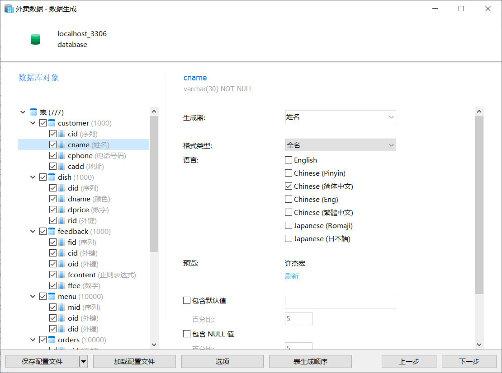

# 实验9 数据库设计

## 实验目的

掌握数据库设计的过程和方法。

## 实验内容和要求

外卖快递平台管理系统设计：

外卖网上订餐已经成为一种普遍现象，请设计一个某个城市的外卖平台管理系统，能够完成对外卖饭店以及外卖菜品的管理，可以实现用户注册，能够完成个人订餐实现在线付款的功能，并能够对送餐人员进行有效管理完成外卖任务，客户可以对外卖小哥进行评价和打赏，并具备统计分析某个时期营业额以及最受欢迎菜品或最勤劳外卖小哥的功能。

## 实验步骤

### 系统需求分析和系统设计

画出系统的 E-R 图，给出实体或联系的属性，标明联系的种类；

#### 实体与属性分析

实体的属性有：

1. 饭店：饭店编号、名称、电话、地址
2. 顾客：顾客编号、名称、电话、地址
3. 配送人员：配送人员编号、名称、电话
4. 菜品：菜品编号、名称、价格
5. 订单：订单编号、订单状态、时间

#### 联系分析

实体的联系有：

1. 一个饭店拥有多个菜品
2. 顾客可以下达多个订单，每个订单只有一名顾客
3. 每个订单内可以有一个菜单
4. 菜单内可包含多个菜品
5. 每个订单都由一名配送人员派送
6. 顾客会对订单的派送人员进行评价与打赏

#### ER图绘制


### ER图转化为关系模型

饭店(<u>饭店编号</u>，名称，电话，地址)

菜品(<u>菜品编号</u>，名称，价格，饭店编号)

顾客(<u>顾客编号</u>，名称，电话，地址)

派送人员(<u>派送人员编号</u>，派送人员名称，电话)

订单(<u>订单编号</u>，顾客编号，饭店编号，订单时间，订单状态，派送人员编号 )

菜单(<u>菜单编号</u>，订单号，菜品编号)

反馈(<u>反馈编号</u>，顾客编号，订单编号，评价，打赏)

### 数据库表设计

<center><strong>饭店表(restruant)</strong></center>

| 字段名 | 中文含义 | 类型        | 约束     | 备注 |
| ------ | -------- | ----------- | -------- | ---- |
| rid    | 饭店编号 | int         | 主键     |      |
| rname  | 名称     | varchar(20) | not null |      |
| rphone | 电话     | varchar(20) | not null |      |
| radd   | 地址     | varchar(50) | not null |      |

<center><strong>顾客表(customer)</strong></center>
| 字段名 | 中文含义 | 类型          | 约束     | 备注 |
| ------ | -------- | ------------- | -------- | ---- |
| cid    | 顾客编号 | int           | 主键     |      |
| cname  | 名称     | varchar(30)   | not null |      |
| cphone | 电话     | decimal(10,2) | not null |      |
| cadd   | 地址     | varchar(50)   | not null |      |

<center><strong>菜品表(dish)</strong></center>

| 字段名 | 中文含义 | 类型          | 约束     | 备注                        |
| ------ | -------- | ------------- | -------- | --------------------------- |
| did    | 菜品编号 | int           | 主键     |                             |
| dname  | 菜品名   | varchar(30)   | not null |                             |
| dprice | 价格     | decimal(10,2) | not null |                             |
| rid    | 饭店编号 | int           | null     | 外键，来自饭店表(restruant) |

<center><strong>派送人员表(post)</strong></center>

| 字段名 | 中文含义     | 类型        | 约束     | 备注 |
| ------ | ------------ | ----------- | -------- | ---- |
| pid    | 派送人员编号 | int         | 主键     |      |
| pname  | 姓名         | varchar(20) | not null |      |
| pphone | 电话         | varchar(20) | not null |      |

<center><strong>订单(order)</strong></center>

| 字段名  | 中文含义     | 类型     | 约束     | 备注                        |
| ------- | ------------ | -------- | -------- | --------------------------- |
| oid     | 订单编号     | int      | 主键     |                             |
| cid     | 顾客编号     | int      | not null | 外键，来自顾客表(customer)  |
| rid     | 饭店编号     | int      | not null | 外键，来自饭店表(restruant) |
| ostatus | 订单状态     | int      | not null |                             |
| otime   | 订单时间     | datetime | not null |                             |
| pid     | 派送人员编号 | int      | null     | 外键，来自派送人员表(post)  |

<center><strong>菜单(menu)</strong></center>

| 字段名 | 中文含义 | 类型 | 约束     | 备注                    |
| ------ | -------- | ---- | -------- | ----------------------- |
| mid    | 菜单编号 | int  | 主键     |                         |
| oid    | 订单编号 | int  | not null | 外键，来自订单表(order) |
| did    | 菜品编号 | int  | not null | 外键，来自菜品表(dish)  |

<center><strong>反馈(feedback)</strong></center>

| 字段名   | 中文含义 | 类型          | 约束     | 备注                       |
| -------- | -------- | ------------- | -------- | -------------------------- |
| fid      | 反馈编号 | int           | 主键     |                            |
| cid      | 顾客编号 | int           | not null | 外键，来自顾客表(customer) |
| oid      | 订单编号 | int           | not null | 外键，来自订单表(order)    |
| fcontent | 评价     | varchar(300)  | null     |                            |
| ffee     | 打赏     | decimal(10,2) | null     |                            |

### 数据库物理设计

#### 设计方案对比：

1. **MySQL方案:**
   - 优点: 简单易用，适合中小型应用。
   - 缺点: 在大规模数据和高并发情况下可能性能不如其他DBMS。
2. **PostgreSQL方案:**
   - 优点: 支持复杂查询、事务处理，适合大型系统。
   - 缺点: 相对较大的系统开销，可能对资源要求较高。
3. **SQLite方案:**
   - 优点: 轻量级，适合小型应用。
   - 缺点: 对高并发和大规模数据支持较差。
4. **Microsoft SQL Server方案:**
   - 优点: 与其他Microsoft产品集成，适合Microsoft生态系统。
   - 缺点: 商业性质，可能有一些成本。

#### 物理结构设计：

1. **表分区：**

   对订单表(order)进行按饭店编号(rid)的分区，以加速对同一饭店的查询。

   ```sql
   sqlCopy code
   ALTER TABLE `order` PARTITION BY HASH (rid);
   ```

2. **索引设计：**

   在订单表(order)的常用查询字段上创建索引，例如：

   ```sql
   sqlCopy codeCREATE INDEX idx_cid ON `order` (cid);
   CREATE INDEX idx_rid ON `order` (rid);
   CREATE INDEX idx_pid ON `order` (pid);
   ```

3. **表空间和文件组：**

   将不同的表分配到不同的表空间或文件组，以便备份和恢复：

   ```sql
   sqlCopy codeCREATE TABLESPACE ts1 ADD DATAFILE 'ts1_datafile1.ibd' SIZE 100M;
   ALTER TABLE `order` TABLESPACE ts1;
   ```

4. **数据类型选择：**

   对于菜品表(dish)的价格字段，选择合适的数据类型以减小存储空间：

   ```sql
   sqlCopy code
   ALTER TABLE dish MODIFY COLUMN dprice FLOAT;
   ```

5. **优化配置：**

   根据系统需求调整数据库引擎、缓冲池大小等配置项，以优化性能。

#### 物理结构设计评价：

1. **时间效率：**

   通过表分区和索引设计，提高了查询效率，尤其是对于订单表(order)的常用查询字段。

2. **空间效率：**

   通过选择合适的数据类型和表分区，减小了存储空间的占用。

3. **可维护性：**

   通过将不同的表分配到不同的表空间，提高了备份和恢复的效率，提高了系统的可维护性。

4. **扩展性：**

   通过合理的物理结构设计，支持了对未来系统扩展的需求。

### 创建数据库表SQL

创建饭店表(resturant)

```sql
create table restaurant(
    rid int primary key auto_increment,
    rname varchar(20) not null,
    rphone varchar(20) not null,
    radd varchar(50) not null
);
```

创建顾客表(customer)

```sql
create table customer(
    cid int primary key auto_increment,
    cname varchar(30) not null,
    cphone varchar(30) not null,
    cadd varchar(50) not null
);
```

创建菜品表(dish)

```sql
create table dish(
    did int primary key auto_increment,
    dname varchar(30) not null,
    dprice decimal(10,2) not null,
    rid int,
    foreign key(rid) references restaurant(rid)
);
```

创建投递人员表(post)

```sql
create table post(
    pid int primary key auto_increment,
    pname varchar(20) not null,
    pphone varchar(20) not null
);
```

创建订单表(orders)

```sql
create table orders
(
    oid     int primary key auto_increment,
    cid     int      not null,
    rid     int      not null,
    ostatus int      not null,
    otime   datetime not null,
    pid     int      not null,
    foreign key (cid) references customer (cid),
    foreign key (pid) references post (pid),
    foreign key (rid) references restaurant (rid)
);
```

创建菜单表(menu)

```sql
create table menu(
    mid int primary key auto_increment,
    oid int not null,
    did int not null,
    foreign key(oid) references orders(oid),
    foreign key(did) references dish(did)
);
```

创建反馈表(feedback)

```sql
create table feedback(
    fid int primary key auto_increment,
    cid int not null,
    oid int not null,
    fcontent varchar(300),
    ffee decimal(10,2),
    foreign key(cid) references customer(cid),
    foreign key(oid) references orders(oid)
);
```

### 创建模拟数据

利用Navcat的数据生成功能，构造测试数据。



<center><strong>Navcat数据生成器</strong></center>

### SQL语言测试

#### 用户注册

```sql
insert into customer (cname, cphone, cadd)
values ('张三', '12345678901', '北京市海淀区');
```

#### 餐厅注册

```sql
insert into restaurant (rname, rphone, radd)
values ('食课', '12345678901', '北京市海淀区');
```

#### 查询某个饭店的所有菜品

```sql
select *
from dish
where rid = (select rid from restaurant where rname = '段岚');
```


#### 查询某个用户的所有订单情况与金额并按照时间降序排序

```sql
select o.oid, o.otime, sum(d.dprice)
from orders as o, menu as m, dish as d
where o.cid = 1 and o.oid = m.oid and m.did = d.did
group by o.oid, o.otime
order by o.otime desc;
```


#### 查找某个时段订单数量最多的配送人员

```sql
select p.pid, p.pname, count(o.oid)
from post as p,
     orders as o
where p.pid = o.pid
  and o.otime between '2022-01-01 00:00:00' and '2023-01-01 00:00:00'
group by p.pid, p.pname
order by count(o.oid) desc
```


#### 查找某个时间段内最受欢迎的菜品

```sql
select d.did, d.dname, sum(m.did)
from dish as d,
     menu as m,
     orders as o
where d.did = m.did
  and m.oid = o.oid
  and o.otime between '2022-01-01 00:00:00' and '2023-01-01 00:00:00'
group by d.did, d.dname
order by sum(m.did) desc;
```


#### 查找某个时间段受到打赏多的配送人员(打赏金额大于800元)

```sql
select p.pid, p.pname, sum(f.ffee)
from post as p,
     feedback as f,
     orders as o
where p.pid = o.pid
  and o.oid = f.oid
  and o.otime between '2022-01-01 00:00:00' and '2023-01-01 00:00:00'
group by p.pid, p.pname
having sum(f.ffee) > 800
order by sum(f.ffee) desc;
```


#### 查找某个时间段内最受欢迎的餐厅(订单数量降序排列)

```sql
select r.rid, r.rname, count(o.oid)
from restaurant as r,
     orders as o
where r.rid = o.rid
  and o.otime between '2022-01-01 00:00:00' and '2023-01-01 00:00:00'
group by r.rid, r.rname
order by count(o.oid) desc;
```


#### 查找近三年消费大于200元的用户

```sql
select c.cid, c.cname, sum(d.dprice)
from customer as c,
     orders as o,
     menu as m,
     dish as d
where c.cid = o.cid
  and o.oid = m.oid
  and m.did = d.did
  and o.otime between '2020-01-01 00:00:00' and '2023-01-01 00:00:00'
group by c.cid, c.cname
having sum(d.dprice) > 200
order by sum(d.dprice) desc;
```


#### 查找近三年营业额最高的前十个饭馆

```sql
select r.rid, r.rname, sum(d.dprice)
from restaurant as r,
     orders as o,
     menu as m,
     dish as d
where r.rid = o.rid
  and o.oid = m.oid
  and m.did = d.did
  and o.otime between '2020-01-01 00:00:00' and '2023-01-01 00:00:00'
group by r.rid, r.rname
order by sum(d.dprice) desc
limit 10;
```


#### 修改指定菜品名称与价格

```sql
update dish
set dname = '鱼香肉丝', dprice = 20
where did = 1;
```

#### 查询某派送人员得到的总打赏金额

```sql
select p.pid, p.pname, sum(f.ffee)
from post as p,
     feedback as f,
     orders as o
where p.pid = o.pid
  and o.oid = f.oid
group by p.pid, p.pname
order by sum(f.ffee) desc;
```

