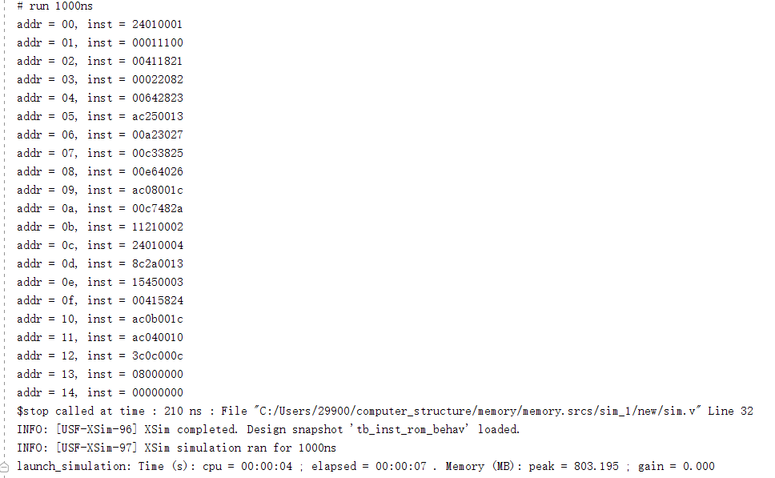
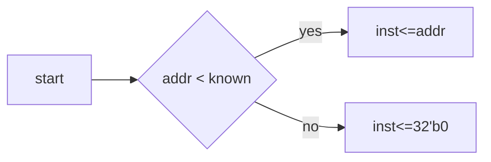
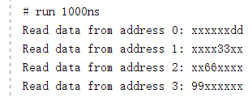

# 存储器实验


## inst_rom.v

异步ROM采用了硬编码的形式，声明了20个宽度为32的wire，并为其逐个连接为所期望指令的内容。模块拥有一个5位的地址输入(0~31共31个字)和一个32位的指令输出，通过选择器将地址与硬编码的内存线路选择性连接，达到按地址访问指令的效果。

> 优缺点分析
>
> 采用硬编码的形式将汇编指令固化在rom中，优点是直观明了、便于理解。但由于是硬编码，无法使用程序对其中的数据进行更改。

### 程序源代码

实验所给源代码如下：

```verilog
`timescale 1ns / 1ps
module inst_rom(
    input      [4 :0] addr, // 指令地址
    output reg [31:0] inst       // 指令
);
    wire [31:0] inst_rom[19:0];  // 指令存储器，字节地址7'b000_0000~7'b111_1111
    //------------- 指令编码 ---------|指令地址|--- 汇编指令 -----|- 指令结果 -----//
    assign inst_rom[ 0] = 32'h24010001; // 00H: addiu $1 ,$0,#1   | $1 = 0000_0001H
    assign inst_rom[ 1] = 32'h00011100; // 04H: sll   $2 ,$1,#4   | $2 = 0000_0010H
    assign inst_rom[ 2] = 32'h00411821; // 08H: addu  $3 ,$2,$1   | $3 = 0000_0011H
    assign inst_rom[ 3] = 32'h00022082; // 0CH: srl   $4 ,$2,#2   | $4 = 0000_0004H
    assign inst_rom[ 4] = 32'h00642823; // 10H: subu  $5 ,$3,$4   | $5 = 0000_000DH
    assign inst_rom[ 5] = 32'hAC250013; // 14H: sw    $5 ,#19($1) | Mem[0000_0014H] = 0000_000DH
    assign inst_rom[ 6] = 32'h00A23027; // 18H: nor   $6 ,$5,$2   | $6 = FFFF_FFE2H
    assign inst_rom[ 7] = 32'h00C33825; // 1CH: or    $7 ,$6,$3   | $7 = FFFF_FFF3H
    assign inst_rom[ 8] = 32'h00E64026; // 20H: xor   $8 ,$7,$6   | $8 = 0000_0011H
    assign inst_rom[ 9] = 32'hAC08001C; // 24H: sw    $8 ,#28($0) | Mem[0000_001CH] = 0000_0011H
    assign inst_rom[10] = 32'h00C7482A; // 28H: slt   $9 ,$6,$7   | $9 = 0000_0001H
    assign inst_rom[11] = 32'h11210002; // 2CH: beq   $9 ,$1,#2   | 跳转到指令34H
    assign inst_rom[12] = 32'h24010004; // 30H: addiu $1 ,$0,#4   | 不执行
    assign inst_rom[13] = 32'h8C2A0013; // 34H: lw    $10,#19($1) | $10 = 0000_000DH
    assign inst_rom[14] = 32'h15450003; // 38H: bne   $10,$5,#3   | 不跳转
    assign inst_rom[15] = 32'h00415824; // 3CH: and   $11,$2,$1   | $11 = 0000_0000H
    assign inst_rom[16] = 32'hAC0B001C; // 40H: sw    $11,#28($0) | Men[0000_001CH] = 0000_0000H
    assign inst_rom[17] = 32'hAC040010; // 44H: sw    $4 ,#16($0) | Mem[0000_0010H] = 0000_0004H
    assign inst_rom[18] = 32'h3C0C000C; // 48H: lui   $12,#12     | [R12] = 000C_0000H
    assign inst_rom[19] = 32'h08000000; // 4CH: j     00H         | 跳转指令00H

    //读指令,取4字节
    always @(*)
        begin
            case (addr)
                5'd0 : inst <= inst_rom[0 ];
                5'd1 : inst <= inst_rom[1 ];
                5'd2 : inst <= inst_rom[2 ];
                5'd3 : inst <= inst_rom[3 ];
                5'd4 : inst <= inst_rom[4 ];
                5'd5 : inst <= inst_rom[5 ];
                5'd6 : inst <= inst_rom[6 ];
                5'd7 : inst <= inst_rom[7 ];
                5'd8 : inst <= inst_rom[8 ];
                5'd9 : inst <= inst_rom[9 ];
                5'd10: inst <= inst_rom[10];
                5'd11: inst <= inst_rom[11];
                5'd12: inst <= inst_rom[12];
                5'd13: inst <= inst_rom[13];
                5'd14: inst <= inst_rom[14];
                5'd15: inst <= inst_rom[15];
                5'd16: inst <= inst_rom[16];
                5'd17: inst <= inst_rom[17];
                5'd18: inst <= inst_rom[18];
                5'd19: inst <= inst_rom[19];
                default: inst <= 32'd0;
            endcase
        end
endmodule
```

### 测试用例

编写testbench(后称tb)，测试模块功能，以下测试用例为读出inst_rom中内容并输出。

```verilog
`timescale 1ns / 1ps

module tb_inst_rom;

    // Inputs
    reg [4:0] addr;
    // Outputs
    wire [31:0] inst;

    // Instantiate the inst_rom module
    inst_rom uut (
        .addr(addr),
        .inst(inst)
    );

    // Clock generation
    reg clk = 0;
    always #5 clk = ~clk;

    // Test stimulus
    initial begin
        // Initialize inputs
        addr = 5'b00000;

        // Apply stimulus
        repeat (20) begin
            #10 addr = addr + 1;
        end

        // End simulation
        //    #10 $finish;
        #10 $stop;
    end

    // Monitor for debugging
    always @(posedge clk) begin
        $display("addr = %h, inst = %h", addr, inst);
    end

endmodule
```



<center><strong>tb运行结果</strong></center>

由图可见，随着时钟周期推移，地址指针增长，成功按顺序取出了inst_rom中的内容。

### 实验代码优化

> 代码优化
>
> 在组合逻辑赋值部分，使用选择器对5位的地址逐个匹配，其余采用默认值，该做法有一定的冗余，可判断给定地址是否位于已赋值区域，若在，则用addr作为索引，若不在，则赋值为0



以下为修改部分的代码。

```verilog
always @(*)
    begin
        if(addr<5'd20) 
            begin
                inst <=inst_rom[addr];
            end
        else
            begin
                inst <=32'd0;
            end
    end
```

替换后的完整代码如下：

```verilog
`timescale 1ns / 1ps
module inst_rom(
    input      [4 :0] addr, // 指令地址
    output reg [31:0] inst       // 指令
    );

    wire [31:0] inst_rom[19:0];  // 指令存储器，字节地址7'b000_0000~7'b111_1111
    //------------- 指令编码 ---------|指令地址|--- 汇编指令 -----|- 指令结果 -----//
    assign inst_rom[ 0] = 32'h24010001; // 00H: addiu $1 ,$0,#1   | $1 = 0000_0001H
    assign inst_rom[ 1] = 32'h00011100; // 04H: sll   $2 ,$1,#4   | $2 = 0000_0010H
    assign inst_rom[ 2] = 32'h00411821; // 08H: addu  $3 ,$2,$1   | $3 = 0000_0011H
    assign inst_rom[ 3] = 32'h00022082; // 0CH: srl   $4 ,$2,#2   | $4 = 0000_0004H
    assign inst_rom[ 4] = 32'h00642823; // 10H: subu  $5 ,$3,$4   | $5 = 0000_000DH
    assign inst_rom[ 5] = 32'hAC250013; // 14H: sw    $5 ,#19($1) | Mem[0000_0014H] = 0000_000DH
    assign inst_rom[ 6] = 32'h00A23027; // 18H: nor   $6 ,$5,$2   | $6 = FFFF_FFE2H
    assign inst_rom[ 7] = 32'h00C33825; // 1CH: or    $7 ,$6,$3   | $7 = FFFF_FFF3H
    assign inst_rom[ 8] = 32'h00E64026; // 20H: xor   $8 ,$7,$6   | $8 = 0000_0011H
    assign inst_rom[ 9] = 32'hAC08001C; // 24H: sw    $8 ,#28($0) | Mem[0000_001CH] = 0000_0011H
    assign inst_rom[10] = 32'h00C7482A; // 28H: slt   $9 ,$6,$7   | $9 = 0000_0001H
    assign inst_rom[11] = 32'h11210002; // 2CH: beq   $9 ,$1,#2   | 跳转到指令34H
    assign inst_rom[12] = 32'h24010004; // 30H: addiu $1 ,$0,#4   | 不执行
    assign inst_rom[13] = 32'h8C2A0013; // 34H: lw    $10,#19($1) | $10 = 0000_000DH
    assign inst_rom[14] = 32'h15450003; // 38H: bne   $10,$5,#3   | 不跳转
    assign inst_rom[15] = 32'h00415824; // 3CH: and   $11,$2,$1   | $11 = 0000_0000H
    assign inst_rom[16] = 32'hAC0B001C; // 40H: sw    $11,#28($0) | Men[0000_001CH] = 0000_0000H
    assign inst_rom[17] = 32'hAC040010; // 44H: sw    $4 ,#16($0) | Mem[0000_0010H] = 0000_0004H
    assign inst_rom[18] = 32'h3C0C000C; // 48H: lui   $12,#12     | [R12] = 000C_0000H
    assign inst_rom[19] = 32'h08000000; // 4CH: j     00H         | 跳转指令00H

    //读指令,取4字节
        always @(*)
        begin
        if(addr<5'd20) begin
            inst <=inst_rom[addr];
         end
         else begin
            inst <=32'd0;
         end
    end
endmodule
```

修改后运行测试结果与原程序一致。

## data_ram.v

该文件为带有写掩码的异步存储器模块，同步写，异步读。声明了32个32位寄存器作为内存，有时钟、写使能、写数据作为输入，读数据作为输出。

由于声明了32组32位寄存器，因此5位地址就可以表示，该模块的可用内存实际为32个字，字节数为32*4

数据的每个字为32位，由四个字节构成，而写掩码wen有4位，依次对应这四个字节的写使能。

### 程序源代码

所给实验原程序如下：

```verilog
`timescale 1ns / 1ps
module data_ram(
    input         clk,         // 时钟
    input  [3:0]  wen,         // 字节写使能
    input  [4:0] addr,        // 地址
    input  [31:0] wdata,       // 写数据
    output reg [31:0] rdata,       // 读数据
);
    reg [31:0] DM[31:0];  //数据存储器，字节地址7'b000_0000~7'b111_1111

    //写数据
    always @(posedge clk)    // 当写控制信号为1，数据写入内存
    begin
        if (wen[3])
        begin
            DM[addr][31:24] <= wdata[31:24];
        end
    end
    always @(posedge clk)
    begin
        if (wen[2])
        begin
            DM[addr][23:16] <= wdata[23:16];
        end
    end
    always @(posedge clk)
    begin
        if (wen[1])
        begin
            DM[addr][15: 8] <= wdata[15: 8];
        end
    end
    always @(posedge clk)
    begin
        if (wen[0])
        begin
            DM[addr][7 : 0] <= wdata[7 : 0];
        end
    end
    
    //读数据,取4字节
    always @(*)
    begin
        rdata<=DM[addr];
        case (addr)
            5'd0 : rdata <= DM[0 ];
            5'd1 : rdata <= DM[1 ];
            5'd2 : rdata <= DM[2 ];
            5'd3 : rdata <= DM[3 ];
            5'd4 : rdata <= DM[4 ];
            5'd5 : rdata <= DM[5 ];
            5'd6 : rdata <= DM[6 ];
            5'd7 : rdata <= DM[7 ];
            5'd8 : rdata <= DM[8 ];
            5'd9 : rdata <= DM[9 ];
            5'd10: rdata <= DM[10];
            5'd11: rdata <= DM[11];
            5'd12: rdata <= DM[12];
            5'd13: rdata <= DM[13];
            5'd14: rdata <= DM[14];
            5'd15: rdata <= DM[15];
            5'd16: rdata <= DM[16];
            5'd17: rdata <= DM[17];
            5'd18: rdata <= DM[18];
            5'd19: rdata <= DM[19];
            5'd20: rdata <= DM[20];
            5'd21: rdata <= DM[21];
            5'd22: rdata <= DM[22];
            5'd23: rdata <= DM[23];
            5'd24: rdata <= DM[24];
            5'd25: rdata <= DM[25];
            5'd26: rdata <= DM[26];
            5'd27: rdata <= DM[27];
            5'd28: rdata <= DM[28];
            5'd29: rdata <= DM[29];
            5'd30: rdata <= DM[30];
            5'd31: rdata <= DM[31];
        endcase
    end
endmodule

```

### 实验代码优化

> 实验代码修改
>
> 由于缺少龙芯平台的硬件，原有代码无法顺利展示，因此对所给代码进行修改，去掉有关LCD展示的部分，并编写testbench进行测试，此处对代码的修改沿用了1.1中介绍的方法进行简化

修改后程序如下：

```verilog
`timescale 1ns / 1ps

module data_ram(
    input         clk,         // 时钟
    input  [3:0]  wen,         // 字节写使能
    input  [4:0] addr,        // 地址
    input  [31:0] wdata,       // 写数据
    output reg [31:0] rdata       // 读数据

);
    reg [31:0] DM[31:0];  //数据存储器，字节地址7'b000_0000~7'b111_1111

    //写数据
    always @(posedge clk)    // 当写控制信号为1，数据写入内存
        begin
            if (wen[3])
                begin
                    DM[addr][31:24] <= wdata[31:24];
                end
        end
    always @(posedge clk)
        begin
            if (wen[2])
                begin
                    DM[addr][23:16] <= wdata[23:16];
                end
        end
    always @(posedge clk)
        begin
            if (wen[1])
                begin
                    DM[addr][15: 8] <= wdata[15: 8];
                end
        end
    always @(posedge clk)
        begin
            if (wen[0])
                begin
                    DM[addr][7 : 0] <= wdata[7 : 0];
                end
        end

    //读数据,取4字节
    always @(*)
        begin
            rdata<=DM[addr];
        end
endmodule

```

编写testbench如下：

```verilog
`timescale 1ns / 1ps

module tb_ram;

    reg clk;
    reg [3:0] wen;
    reg [4:0] addr;
    reg [31:0] wdata;
    wire [31:0] rdata;

    // Instantiate the data_ram module
    data_ram uut (
        .clk(clk),
        .wen(wen),
        .addr(addr),
        .wdata(wdata),
        .rdata(rdata)
    );

    // Clock generation
    always begin
        #5 clk = ~clk;
    end

    // Stimulus
    initial begin
        // Initialize inputs
        clk = 0;
        wen = 4'b0000;
        addr = 5'b00000;
        wdata = 32'h00000000;

        // Apply some writes
        #10 wen = 4'b0001; addr = 5'b00000; wdata = 32'hAABBCCDD;
        #10 wen = 4'b0010; addr = 5'b00001; wdata = 32'h11223344;
        #10 wen = 4'b0100; addr = 5'b00010; wdata = 32'h55667788;
        #10 wen = 4'b1000; addr = 5'b00011; wdata = 32'h99001122;
        #10 wen = 4'b0000;

        // Read from specific addresses
        #10 addr = 5'b00000;
        #10 $display("Read data from address %0d: %h", addr, rdata);

        #10 addr = 5'b00001;
        #10 $display("Read data from address %0d: %h", addr, rdata);

        #10 addr = 5'b00010;
        #10 $display("Read data from address %0d: %h", addr, rdata);

        #10 addr = 5'b00011;
        #10 $display("Read data from address %0d: %h", addr, rdata);

        // End simulation
        #10 $finish;
    end

endmodule

```

在该testbench中，分别尝试了使用不同的掩码对不同的地址进行写入，随后将相应地址的数据读出。

将修改后的程序使用vivado进行行为仿真测试，得到结果如图



<center><strong>ram仿真结果</strong></center>

由程序输出结果可得，只有写掩码对应为1的位有数据，其余位处于不定态，表示并未被赋值过。


