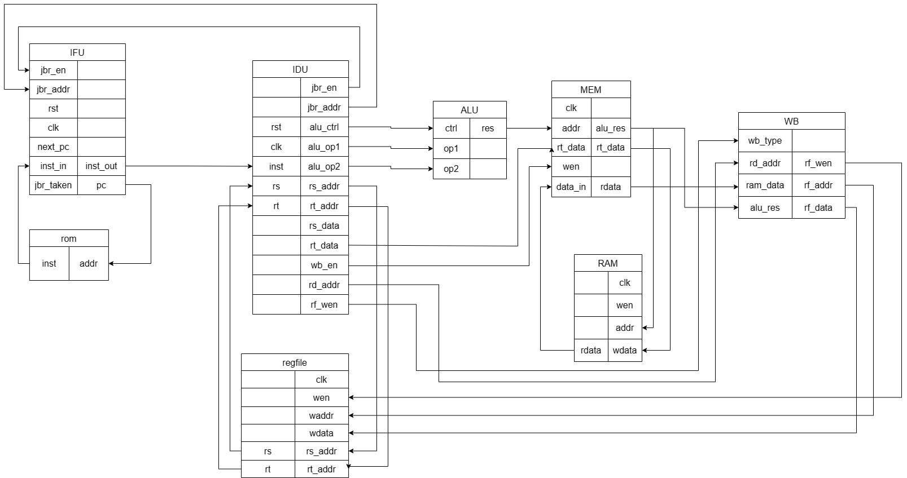
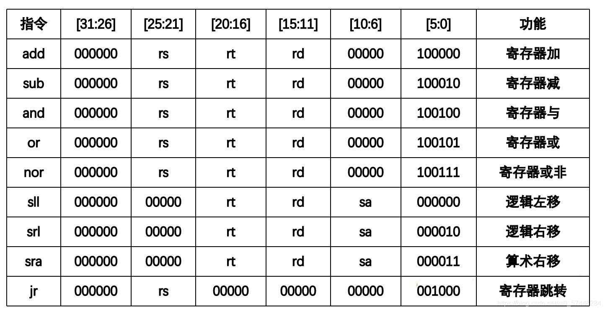
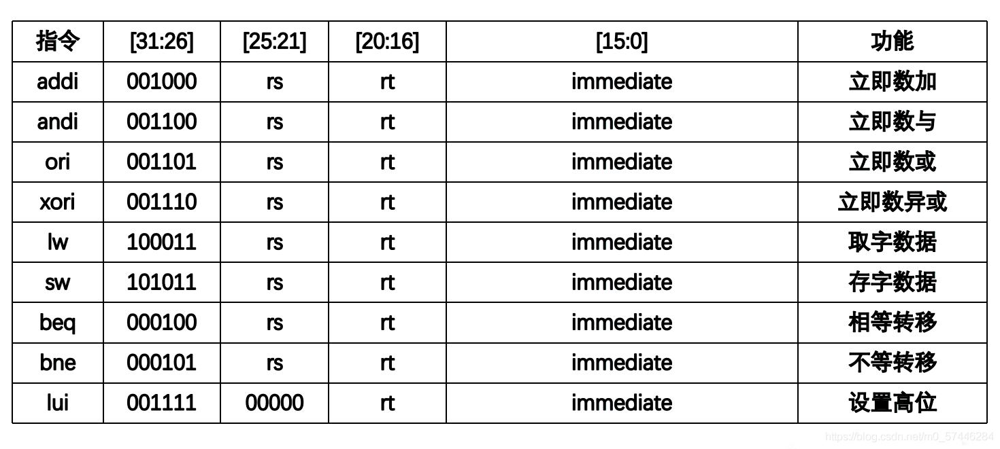
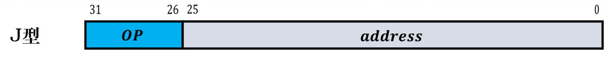
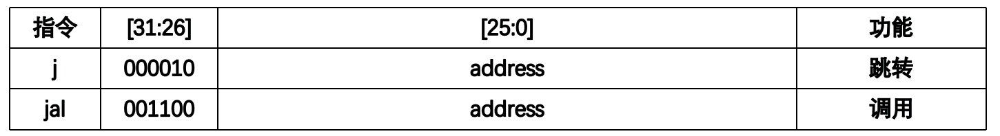

# CPU实验

## CPU构成

单周期cpu的运行主要由取指、译码、运算、访存、写回五个阶段组成。

取指：负责维护PC地址，根据PC对rom进行读操作，需要根据后续可能存在的跳转指令更新PC寄存器

译码：根据MIPS指令集手册中规定的**R型指令**，**I型指令**，**J型指令**三种格式，对每条长度都为32位的指令进行拆分，通过对操作码和功能码的判断，确定指令类型，进而决定下条指令PC地址、从寄存器或立即数获取送入ALU进行运算的操作数、操作码

运算：ALU部件根据译码送入的操作码与操作数，对操作数进行相应处理，随后使用选择器输出操作码对应的操作数

访存：涉及ram访问的部分主要在此处实现

写回：运算结果写回寄存器

给定程序的数据通路如下图所示：



<center><strong>单周期CPU数据通路图</strong></center>

单周期CPU的组成间上图

## MIPS指令集分析

为了实现译码功能，需要对指令集有所了解，MIPS指令集的指令格式可分为三种操作类型：**R型指令**，**I型指令**，**J型指令**

### R型指令


- OP：000000     由func来决定他的功能
- rs、rt是两个源操作数所在的寄存器号
- rd是目的操作数所在的寄存器号
- shamt是位移量，执行移位操作的时候指明需要移动的次数

涉及到的指令如下：



### I型指令


- 操作功能由OP决定
- rs是第一个源操作数，immediate是第二个源操作数
- rt是目的操作数所在的寄存器编号

涉及到的指令如下：



- addi指令需要进行符号位扩展，andi、ori、xori指令只需要进行零扩展
- sw、lw、beq、bne等操作都是进行符号位扩展

### J型指令



- 操作功能由OP决定
- 转移地址：26位（立即数）

J型指令操作表



### 实验相关指令

根据给定程序，实现的指令有如下16条

```verilog
// 实现指令列表
wire inst_ADDU, inst_SUBU , inst_SLT, inst_AND;
wire inst_NOR , inst_OR   , inst_XOR, inst_SLL;
wire inst_SRL , inst_ADDIU, inst_BEQ, inst_BNE;
wire inst_LW  , inst_SW   , inst_LUI, inst_J;
```

其中，R型指令有

```verilog
assign inst_ADDU  = op_zero & sa_zero    & (funct == 6'b100001);// 无符号加法
assign inst_SUBU  = op_zero & sa_zero    & (funct == 6'b100011);// 无符号减法
assign inst_SLT   = op_zero & sa_zero    & (funct == 6'b101010);// 小于则置位
assign inst_AND   = op_zero & sa_zero    & (funct == 6'b100100);// 逻辑与运算
assign inst_NOR   = op_zero & sa_zero    & (funct == 6'b100111);// 逻辑或非运算
assign inst_OR    = op_zero & sa_zero    & (funct == 6'b100101);// 逻辑或运算
assign inst_XOR   = op_zero & sa_zero    & (funct == 6'b100110);// 逻辑异或运算
assign inst_SLL   = op_zero & (rs==5'd0) & (funct == 6'b000000);// 逻辑左移
assign inst_SRL   = op_zero & (rs==5'd0) & (funct == 6'b000010);// 逻辑右移
```

I形指令有：

```verilog
assign inst_ADDIU = (op == 6'b001001);                  // 立即数无符号加法
assign inst_BEQ   = (op == 6'b000100);                  // 判断相等跳转
assign inst_BNE   = (op == 6'b000101);                  // 判断不等跳转
assign inst_LW    = (op == 6'b100011);                  // 从内存装载
assign inst_SW    = (op == 6'b101011);                  // 向内存存储
assign inst_LUI   = (op == 6'b001111);                  // 立即数装载高半字节
```

还有一条J型指令

```verilog
assign inst_J     = (op == 6'b000010);                  // 直接跳转
```

## 取值实现

PC寄存器由一个带有复位的触发器维护，当时钟下降沿时更新，resetn低电平时复位PC为0，高电平则将next_pc装入PC

next_pc由一个选择器维护，jbr_taken来自译码器结果，高电平使能，跳转来自译码器的地址jbr_target，低电平则PC寄存器自增4字节，顺序执行下一条指令。

该模块中例化了rom模块，使用PC从ROM中取出inst，并传递给译码器

## 译码实现

### 指令拆分

根据指令格式，将指令不同部分切分

```verilog
assign op     = inst[31:26];  // 操作码
assign rs     = inst[25:21];  // 源操作数1
assign rt     = inst[20:16];  // 源操作数2
assign rd     = inst[15:11];  // 目标操作数
assign sa     = inst[10:6];   // 特殊域，可能存放偏移量
assign funct  = inst[5:0];    // 功能码
assign imm    = inst[15:0];   // 立即数
assign offset = inst[15:0];   // 地址偏移量
assign target = inst[25:0];   // 目标地址
```

同时，为了判别数量众多的R型指令，使用缩位判别op与sa是否为0

```verilog
wire op_zero;  // 操作码全0
wire sa_zero;  // sa域全0
assign op_zero = ~(|op);
assign sa_zero = ~(|sa);
```

当op缩位全0，则为R型指令。用funct决定具体功能

### 分支与跳转

涉及到指令执行流程变化的主要有j beq bne三条指令，当指令为这三者时，需要判断是否满足跳转要求，并拼接跳转地址jbr_target，满足要求则使能跳转jbr_taken。这两个控制量送回取指器。

```verilog
// 无条件跳转判断
wire        j_taken;
wire [31:0] j_target;
assign j_taken  = inst_J;
// 无条件跳转目标地址：PC={PC[31:28],target<<2}
assign j_target = {pc[31:28], target, 2'b00};

//分支跳转
wire        beq_taken;
wire        bne_taken;
wire [31:0] br_target;
assign beq_taken = (rs_value == rt_value);       // BEQ跳转条件：GPR[rs]=GPR[rt]
assign bne_taken = ~beq_taken;                   // BNE跳转条件：GPR[rs]≠GPR[rt]
assign br_target[31:2] = pc[31:2] + {{14{offset[15]}}, offset};
assign br_target[1:0]  = pc[1:0];    // 分支跳转目标地址：PC=PC+offset<<2

//跳转指令的跳转信号和跳转目标地址
assign jbr_taken = j_taken              // 指令跳转：无条件跳转 或 满足分支跳转条件
    | inst_BEQ & beq_taken
    | inst_BNE & bne_taken;
assign jbr_target = j_taken ? j_target : br_target;
```

### 操作数处理

根据拆分后的指令中rs，rt的索引，从寄存器堆中取出rs rt值，并对立即数进行符号拓展。根据指令类型确定指令操作数类型，使用选择器选择指令对应的操作数。

```verilog
wire [31:0] sext_imm;
wire   inst_shf_sa;    //使用sa域作为偏移量的指令
wire   inst_imm_sign;  //对立即数作符号扩展的指令
assign sext_imm      = {{16{imm[15]}}, imm};// 立即数符号扩展
assign inst_shf_sa   = inst_SLL | inst_SRL;
assign inst_imm_sign = inst_ADDIU | inst_LUI | inst_LW | inst_SW;

wire [31:0] alu_operand1;
wire [31:0] alu_operand2;
wire [11:0] alu_control;
assign alu_operand1 = inst_shf_sa ? {27'd0,sa} : rs_value;
assign alu_operand2 = inst_imm_sign ? sext_imm : rt_value;
```

### 操作码处理

同样的，根据指令类型，确定ALU需要执行的操作类型

```verilog
// 传递到执行模块的ALU源操作数和操作码
wire inst_add, inst_sub, inst_slt,inst_sltu;
wire inst_and, inst_nor, inst_or, inst_xor;
wire inst_sll, inst_srl, inst_sra,inst_lui;
assign inst_add = inst_ADDU | inst_ADDIU | inst_LW | inst_SW; // 做加法运算指令
assign inst_sub = inst_SUBU; // 减法
assign inst_slt = inst_SLT;  // 小于置位
assign inst_sltu= 1'b0;      // 暂未实现
assign inst_and = inst_AND;  // 逻辑与
assign inst_nor = inst_NOR;  // 逻辑或非
assign inst_or  = inst_OR;   // 逻辑或
assign inst_xor = inst_XOR;  // 逻辑异或
assign inst_sll = inst_SLL;  // 逻辑左移
assign inst_srl = inst_SRL;  // 逻辑右移
assign inst_sra = 1'b0;      // 暂未实现
assign inst_lui = inst_LUI;  // 立即数装载高位
```

确定后，将操作码拼装为独热编码传递给ALU

```verilog
assign alu_control = {inst_add,        // ALU操作码，独热编码
                      inst_sub,
                      inst_slt,
                      inst_sltu,
                      inst_and,
                      inst_nor,
                      inst_or, 
                      inst_xor,
                      inst_sll,
                      inst_srl,
                      inst_sra,
                      inst_lui};
```

## 执行、访存和写回

操作数与操作码送入ALU后，ALU将独热码重新解码，使用组合逻辑实现每一种运算，随后接入选择器，根据操作码返回相应的操作数。

访存阶段，根据指令类型（多周期则根据译码器结果）决定访存操作、地址与写入ram的数据。

```verilog
assign dm_wen   = {4{inst_SW}} & resetn;    // 内存写使能,非resetn状态下有效
assign dm_addr  = alu_result;               // 内存写地址，为ALU结果
assign dm_wdata = rt_value;                 // 内存写数据，为rt寄存器值
```

写回阶段，指将数据写回寄存器堆，根据指令类型确定写回的寄存器是rt还是rd，写回的结果是访存阶段读入的数据还是ALU运算的结果。

```verilog
wire inst_wdest_rt;   // 寄存器堆写入地址为rt的指令
wire inst_wdest_rd;   // 寄存器堆写入地址为rd的指令
assign inst_wdest_rt = inst_ADDIU | inst_LW | inst_LUI;
assign inst_wdest_rd = inst_ADDU | inst_SUBU | inst_SLT | inst_AND | inst_NOR
    | inst_OR   | inst_XOR  | inst_SLL | inst_SRL;                   
// 寄存器堆写使能信号，非复位状态下有效
assign rf_wen   = (inst_wdest_rt | inst_wdest_rd) & resetn;
assign rf_waddr = inst_wdest_rd ? rd : rt;        // 寄存器堆写地址rd或rt
assign rf_wdata = inst_LW ? dm_rdata : alu_result;// 写回结果，为load结果或ALU结果
```

至此，整个单周期CPU的指令执行就告一段落了。

## 测试运行

为单周期CPU编写testbench进行测试，对运行过程中寄存器的值进行跟踪，对单周期cpu留给上层的数据接口取出的指令进行拆分，得到寄存器索引，在每条指令执行结束后打印一次操作涉及到的寄存器。

```verilog
`timescale 1ns / 1ps

module tb;

    // Inputs
    reg clk;
    reg resetn;
    reg [4:0] rf_addr;
    reg [31:0] mem_addr;

    // Outputs
    wire [31:0] rf_data;
    wire [31:0] mem_data;
    wire [31:0] cpu_pc;
    wire [31:0] cpu_inst;

    reg [4:0] rs;       
    reg [4:0] rt;       
    reg [4:0] rd;

    // Instantiate the Unit Under Test (UUT)
    single_cycle_cpu uut (
        .clk(clk), 
        .resetn(resetn), 
        .rf_addr(rf_addr), 
        .mem_addr(mem_addr), 
        .rf_data(rf_data), 
        .mem_data(mem_data), 
        .cpu_pc(cpu_pc), 
        .cpu_inst(cpu_inst)
    );

    initial begin
        // Initialize Inputs
        clk = 0;
        resetn = 0;
        rf_addr = 0;
        mem_addr = 0;

        // Wait 10 ns for global reset to finish
        #10;
        resetn = 1;
        // Add stimulus here

        while(1) begin
            // 每周期执行一次
            // 打印程序运行过程
            $display("pc=%h, inst=%h", cpu_pc, cpu_inst);
            // 打印指令中对应的寄存器值
            // 分割指令中寄存器字段
            rs     = cpu_inst[25:21];  // 源操作数1
            rt     = cpu_inst[20:16];  // 源操作数2
            rd     = cpu_inst[15:11];  // 目标操作数
            // 将字段依次赋值给rf_addr,并打印rf_data
            rf_addr = rs;
            $display("rs=%h, rf_data=%h", rs, rf_data);
            rf_addr = rt;
            $display("rt=%h, rf_data=%h", rt, rf_data);
            rf_addr = rd;
            $display("rd=%h, rf_data=%h", rd, rf_data);
            #10;
        end

    end
    always #5 clk=~clk;
endmodule
```

在vivado上进行仿真，效果如下：

```verilog
pc=00000000, inst=24010001
rs=00, rf_data=00000000
rt=01, rf_data=00000000
rd=00, rf_data=00000000
pc=00000004, inst=00011100
rs=00, rf_data=00000000
rt=01, rf_data=00000000
rd=02, rf_data=00000000
pc=00000008, inst=00411821
rs=02, rf_data=00000010
rt=01, rf_data=00000010
rd=03, rf_data=00000010
pc=0000000c, inst=00022082
rs=00, rf_data=00000011
rt=02, rf_data=00000011
rd=04, rf_data=00000011
pc=00000010, inst=00642823
rs=03, rf_data=00000004
rt=04, rf_data=00000004
rd=05, rf_data=00000004
pc=00000014, inst=ac250013
rs=01, rf_data=0000000d
rt=05, rf_data=0000000d
rd=00, rf_data=0000000d
pc=00000018, inst=00a23027
rs=05, rf_data=00000000
rt=02, rf_data=00000000
rd=06, rf_data=00000000
pc=0000001c, inst=00c33825
rs=06, rf_data=ffffffe2
rt=03, rf_data=ffffffe2
rd=07, rf_data=ffffffe2
pc=00000020, inst=00e64026
rs=07, rf_data=fffffff3
rt=06, rf_data=fffffff3
rd=08, rf_data=fffffff3
pc=00000024, inst=ac08001c
rs=00, rf_data=00000011
rt=08, rf_data=00000011
rd=00, rf_data=00000011
pc=00000028, inst=00c7482a
rs=06, rf_data=00000000
rt=07, rf_data=00000000
rd=09, rf_data=00000000
pc=0000002c, inst=11210002
rs=09, rf_data=00000001
rt=01, rf_data=00000001
rd=00, rf_data=00000001
pc=00000034, inst=8c2a0013
rs=01, rf_data=00000000
rt=0a, rf_data=00000000
rd=00, rf_data=00000000
pc=00000038, inst=15450003
rs=0a, rf_data=00000000
rt=05, rf_data=00000000
rd=00, rf_data=00000000
```

用这种方式实现了对指令运行过程的跟踪。

