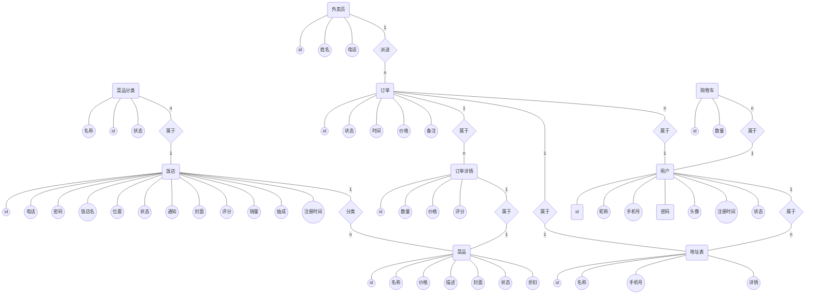

**参考题目10：外卖订餐系统的设计与实现**

**题目概述：**

 打包形式是最早出现的外卖形式，随着网络的普及，外卖行业得到迅速的发展。为了提高餐饮销售业务水平和效率，餐饮外卖网站应运而生。外卖系统做为餐厅和食客的连接，为饭店和食客带来了极大的方便，不仅可以帮助饭店创造更多盈利，还可以使就餐者足不出户就能享受到美味。该系统还可以使就餐者及时对美食做出评价，用户可以对餐厅按照不同标准进行排序。用户的反馈可以帮助饭店做出改进提升，饭店的提升会带来更多的客流量，因此，该系统不仅可以提高用户的生活质量，还可以为餐饮业带来长足进步。

**题目要求：**

分析外卖订餐系统所必备的功能，系统设置三个角色：饭店、食客、管理员。

1）   管理员可以管理各个饭店和食客的基本信息和权限、以及平台的抽成比例；

2）   各个饭店通过认证后，可以登陆平台，自行设置菜品种类和菜品价格以及优惠力度；

3）   食客可以实名制注册登陆平台，完成菜品的网上点餐和支付；

4）   系统能匹配相应外卖快递人员送菜品到食客家；

5）   食客可以对外卖人员的服务以及饭店的菜品质量进行评价打分；

管理员可以统计某个时期内平台的收入以及销售额多的饭店，各个饭店也可以统计某个时期内的销售额以及最受欢迎的菜品，食客可以查询和统计自己的外卖订单。

