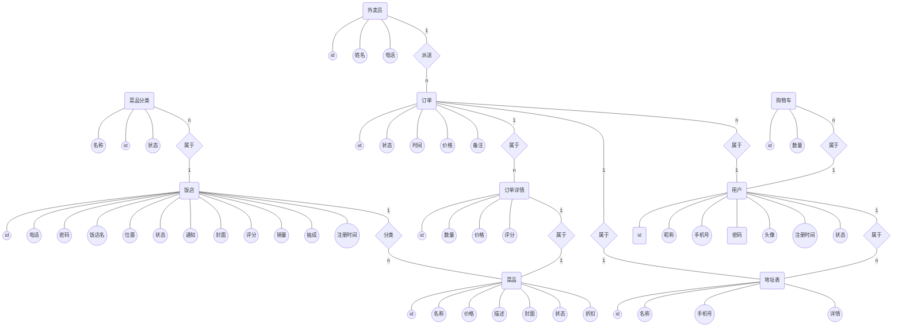

# 参考题目10：外卖订餐系统的设计与实现

## 题目概述

 打包形式是最早出现的外卖形式，随着网络的普及，外卖行业得到迅速的发展。为了提高餐饮销售业务水平和效率，餐饮外卖网站应运而生。外卖系统做为餐厅和食客的连接，为饭店和食客带来了极大的方便，不仅可以帮助饭店创造更多盈利，还可以使就餐者足不出户就能享受到美味。该系统还可以使就餐者及时对美食做出评价，用户可以对餐厅按照不同标准进行排序。用户的反馈可以帮助饭店做出改进提升，饭店的提升会带来更多的客流量，因此，该系统不仅可以提高用户的生活质量，还可以为餐饮业带来长足进步。

## 题目要求

分析外卖订餐系统所必备的功能，系统设置三个角色：饭店、食客、管理员。

1）   管理员可以管理各个饭店和食客的基本信息和权限、以及平台的抽成比例；

2）   各个饭店通过认证后，可以登陆平台，自行设置菜品种类和菜品价格以及优惠力度；

3）   食客可以实名制注册登陆平台，完成菜品的网上点餐和支付；

4）   系统能匹配相应外卖快递人员送菜品到食客家；

5）   食客可以对外卖人员的服务以及饭店的菜品质量进行评价打分；

管理员可以统计某个时期内平台的收入以及销售额多的饭店，各个饭店也可以统计某个时期内的销售额以及最受欢迎的菜品，食客可以查询和统计自己的外卖订单。

## 数据库设计

### ER图



### 数据表

#### Table: user
| Field    | Type         | Constraints                                    | Comment   |
| -------- | ------------ | ---------------------------------------------- | --------- |
| id       | bigint       | primary key auto_increment                     |           |
| username | varchar(255) | not null                                       | 用户名    |
| phone    | varchar(255) | not null, unique                               | 手机号    |
| password | varchar(255) | not null                                       | 密码      |
| avatar   | varchar(255) |                                                | 头像      |
| regtime  | datetime     | not null, default now()                        | 注册时间  |
| status   | int          | not null, check (status in (0, 1, 2, 3, 4, 5)) | default 0 |

#### Table: address
| Field  | Type         | Constraints                | Comment  |
| ------ | ------------ | -------------------------- | -------- |
| id     | bigint       | primary key auto_increment |          |
| uid    | bigint       | 外键user(id)               | 用户id   |
| name   | varchar(255) |                            | 姓名     |
| phone  | varchar(255) |                            | 手机号   |
| detail | varchar(255) |                            | 详细地址 |

#### Table: restaurant
| Field    | Type          | Constraints                                     | Comment            |
| -------- | ------------- | ----------------------------------------------- | ------------------ |
| id       | bigint        | primary key auto_increment                      |                    |
| name     | varchar(255)  | not null                                        | 饭店名称           |
| phone    | varchar(255)  | not null, unique                                | 饭店电话           |
| password | varchar(255)  | not null                                        | 密码               |
| announce | varchar(255)  |                                                 | 描述信息           |
| address  | varchar(255)  |                                                 | 地址               |
| cover    | varchar(255)  |                                                 | 封面               |
| sale     | bigint        | not null, default 0                             | 销量               |
| mark     | decimal(2, 1) | check (mark <= 5 and mark >= 1)                 | 评分               |
| percent  | decimal(4, 2) | not null, default 10.00                         | 抽成               |
| regtime  | datetime      | default now()                                   | 注册时间           |
| status   | int           | default 0, check (status in (0, 1, 2, 3, 4, 5)) | 订单状态 default 0 |

#### Table: category
| Field  | Type         | Constraints                          | Comment  |
| ------ | ------------ | ------------------------------------ | -------- |
| id     | bigint       | primary key auto_increment           |          |
| rid    | bigint       | not null, 外键restaurant(id)         | 所属饭店 |
| name   | varchar(255) | not null                             | 分类名称 |
| status | int          | check (status in (0, 1, 2, 3, 4, 5)) | 分类状态 |

#### Table: dish
| Field    | Type          | Constraints                          | Comment |
| -------- | ------------- | ------------------------------------ | ------- |
| id       | bigint        | primary key auto_increment           |         |
| cid      | bigint        | not null, 外键category (id)          | 分类    |
| name     | varchar(255)  | not null                             | 菜品名  |
| descr    | varchar(255)  |                                      | 描述    |
| price    | decimal(6, 2) | not null                             | 价格    |
| discount | decimal(4, 2) | not null, default 0.00               | 折扣    |
| cover    | varchar(255)  |                                      | 封面    |
| status   | int           | check (status in (0, 1, 2, 3, 4, 5)) | 状态    |

#### Table: orders
| Field       | Type          | Constraints                          | Comment    |
| ----------- | ------------- | ------------------------------------ | ---------- |
| id          | bigint        | primary key auto_increment           |            |
| uid         | bigint        | 外键user (id)                        | 用户       |
| aid         | bigint        | 外键address (id)                     | 地址       |
| totalprice  | decimal(8, 2) |                                      | 订单总价格 |
| create_time | datetime      | not null, default now()              | 创建时间   |
| comment     | varchar(255)  |                                      | 订单备注   |
| status      | int           | check (status in (0, 1, 2, 3, 4, 5)) | 订单状态   |

#### Table: orderdetail
| Field    | Type          | Constraints                                | Comment |
| -------- | ------------- | ------------------------------------------ | ------- |
| id       | bigint        | primary key auto_increment                 |         |
| oid      | bigint        | 外键orders (id)                            | 订单    |
| did      | bigint        | 外键dish (id)                              | 菜品    |
| price    | decimal(6, 2) |                                            | 价格    |
| mark     | int           | default 0, check (mark <= 5 and mark >= 0) | 评分    |
| quantity | int           | not null, default 1                        | 数量    |

#### Table: shopcar
| Field    | Type   | Constraints                | Comment |
| -------- | ------ | -------------------------- | ------- |
| id       | bigint | primary key auto_increment |         |
| uid      | bigint | not null, 外键user (id)    | 用户    |
| did      | bigint | not null                   | 菜品    |
| quantity | int    | not null, default 1        | 数量    |

## 接口描述

格式：

```python
# 接口名(详细描述)
{请求参数, (可选参数) ...}
->[直接参数, {json对象} ...]
```

未定义返回参数的不要求有效返回数据，用`[]`包裹的为列表，用`()`包裹的是可选参数，`...`代表相同类型的参数多个，`{}`包裹的为JSON

### 商家后台

登陆

```json
# 登录
{phone, passwd}
->{商家id name token}
```

菜品分类(0禁用 1启用)

```json
# 新增分类
{名称，初始状态}
# 修改分类状态
{分类字段}
# 删除分类
{有效id}
```

菜品(0禁售 1启售)

```json
# 更新菜品(不存在则添加)
{菜品字段}
# 获取本店铺菜品
{page, pagesize, (name)}
->
[
    {菜品字段}
    ...
]
# 批量删除菜品
[菜品id ...]
# 批量停售
[菜品id ...]
# 批量启售
[菜品id ...]
```

订单(0待出餐，1已出餐，2已退单)

```json
# 获取明细
{page, pagesize, (订单id), (begindate, enddate)}
->
[
    {
        订单号,status,用户名,
        {下单地址},
    	手机号,下单时间,金额
    }
    ...
]
# 修改订单状态
{id, status}
```

店铺信息

```json
# 店铺信息获取
{null}
->
{店铺信息字段}
# 店铺信息修改(按需更新)
{店铺信息字段}
```

### 用户端

店铺相关

```json
# 获取店铺信息
{key:店铺名, page, pagesize}
->
[
    {店铺字段}
    ...
]
# 获取分类列表(status=1)
{null}
->
[
    {分类字段}
    ...
]
```

菜品相关

```json
# 获取指定分类的菜品(status=1)
{店铺id, cid, page, pagesize}
->
[
    {菜品字段}
    ...
]
```

购物车相关

```json
# 获取购物车内容
{null}
->
[
    {购物车字段}
    ...
]
# 修改购物车内购物车商品(不存在时添加，当amount为0直接删除)
{商品id, amount}
```

订单相关

```json
# 用户查询自己的订单
{page, pagesize}
->
[
    {订单内容字段}
    ...
]
# 用户查询订单详情
{订单id}
->
[
    {
        订单详情字段
        dish:{菜品信息字段}
    }
    ...
]
# 生成订单(下单)
{aid, comment, {[购物车id] ...}}
```

用户信息相关

```json
# 用户获取个人信息
{null}
->
{
    个人信息字段
}
# 用户修改个人信息
{分类字段}
```

用户地址相关

```json
# 获取个人地址
{null}
->
[
    {地址字段}
    ...
]
# 更新个人地址(不存在则添加)
{个人地址字段}
```


